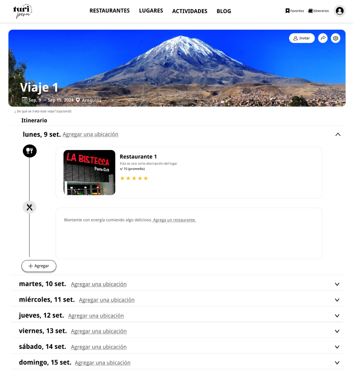

# 2.1. Requerimientos Funcionales

### Módulo de reseñas y comentarios
Cada restaurante, lugar turístico, actividad, hotel y entre otros, tienen su apartado de reseñas y comentarios por parte de los usuario de Turi. Este módulo permite a los usuarios compartir sus experiencias y opiniones sobre diferentes lugares visitados durante sus viajes, aquí pueden calificar con un sistema de 5 estrellas, dejar descripciones detalladas de su experiencia, y adjuntar fotos y videos que respalden su reseña en caso así lo deseen. 

El sistema debe permitir que los usuarios publiquen sus reseñas y comentarios sobre lugar turístico, actividades, hoteles y entre otros. Las publicaciones deben estar monitoreadas por un sistema de detección de contenido inapropiado para garantizar que se publique información relevante y que cuide la integridad de nuestros usuarios. Además, los usuarios pueden darle _like_ y comentar otras reseñas. También, los usuarios pueden reportar la reseñas y comentarios de otros usuarios en la plataforma. Debe contar con un sistema de detección de palabras clave que no pueden ser publicadas en la plataforma, además de estar integrado con una plataforma de administrador donde las personas designadas para el monitoreo de contenido estén siempre pendientes por si algo se pasa del filtro.

### Blog

El Blog de Turi es un espacio interactivo dentro de la plataforma donde los usuarios pueden compartir sus experiencias de viajes, prueba de lugares y dar recomendaciones sobre los lugares y servicios ofrecidos en la página. Este módulo funciona como un foro/comunidad, permitiendo a los usuarios publicar historias, fotos y videos de sus experiencias, así como interactuar entre sí comentando las publicaciones de otros, creando hilos de conversación.
Las publicaciones pueden incluir hashtags y categorías para facilitar la búsqueda de contenido relacionado, y el blog destaca los 5 hashtags más populares en una tabla al inicio, con acceso directo a las publicaciones asociadas. Además, los usuarios pueden filtrar el contenido por categorías específicas para ver solo los temas que más les interesen.
- Registro de publicaciones: El sistema debe permitir a los usuarios registrados crear publicaciones en el blog, añadiendo texto, imágenes y videos relacionados con sus experiencias en los destinos turísticos.
- Comentarios en Publicaciones: El sistema debe permitir que los usuarios comenten en las publicaciones de otros, generando un hilo de conversación.
- Sistema de Búsqueda y Filtrado: El sistema debe permitir la búsqueda de publicaciones mediante hashtags o categorías seleccionadas por los usuarios.
- Visualizacion de publicaciones: El sistema debe permitir a los usuarios ver las publicaciones y comentarios de otros usuarios en sus perfiles.
- Ver tendencias: El sistema debe contar con una función que calcule la popularidad de los hashtags según su uso en las publicaciones.

### Módulo de Autenticación y Seguridad
1. **Registro de nuevos usuarios**:
   - El sistema debe permitir a los usuarios crear una cuenta proporcionando correo electrónico, número de teléfono y una contraseña.
   - El sistema debe enviar un correo de validación para confirmar la autenticidad del usuario antes de activar la cuenta.

2. **Inicio de sesión**:
   - El sistema debe validar las credenciales del usuario (correo/usuario y contraseña) al intentar iniciar sesión.
   - El sistema debe bloquear la cuenta después de 5 intentos fallidos de inicio de sesión.
   - El sistema debe ofrecer la opción de **autenticación multifactor (MFA)** a través de correo electrónico o SMS.

3. **Asignación de roles**:
   - El sistema debe asignar automáticamente el rol de Usuario, Administrador de Contenido o Agente de Soporte según el perfil del usuario.
   - El sistema debe limitar el acceso a funcionalidades específicas en base al rol asignado.

4. **Recuperación de contraseña**:
   - El sistema debe permitir a los usuarios solicitar un restablecimiento de contraseña enviando un enlace seguro al correo electrónico registrado.
   - El enlace de recuperación debe tener un tiempo de expiración de 15 minutos.

5. **Gestión de sesiones**:
   - El sistema debe permitir que los usuarios mantengan una única sesión activa por dispositivo.

6. **Cierre de sesión**:
   - El sistema debe permitir al usuario cerrar sesión manualmente desde cualquier dispositivo.

7. **Protección contra ataques de fuerza bruta**:
   - El sistema debe detectar y bloquear intentos de inicio de sesión repetidos y fallidos (máximo 5 intentos fallidos).
   - El bloqueo de la cuenta debe durar hasta el siguiente día tras el quinto intento fallido.

## Módulo de recomendaciones
El sistema debe proporcionar recomendaciones personalizadas a los usuarios basadas en sus preferencias, ubicación y condiciones climáticas. Este m dulo debe analizar el historial del usuario, comparar con otros perfiles similares y generar sugerencias de actividades, lugares de interés y restaurantes. Las recomendaciones deben actualizarse en tiempo real seg n los cambios de ubicación o preferencias del usuario.

- El sistema debe ofrecer recomendaciones basadas en:
  - Preferencias del usuario previamente registradas.
  - Ubicaci n geográfica actual del usuario.
  - Condiciones climáticas en tiempo real.
- El módulo debe sugerir actividades y lugares de interés turístico, con opciones filtradas por categorías como gastronomía, cultura, y deportes.
- Las recomendaciones deben actualizarse automáticamente cada vez que el usuario cambie su ubicación.
- El sistema debe permitir al usuario aceptar, rechazar o guardar recomendaciones, ajustándose a estas decisiones para futuras sugerencias.

## Ver reporte de ingresos por organizacion
El sistema debe permitir a las empresas visualizar un reporte completo de los ingresos generados a trav�s de la plataforma Turi. Este reporte debe estar organizado por entidad y proporcionar informaci�n financiera detallada, ayudando a las organizaciones a monitorear su rendimiento, identificar oportunidades de mejora y tomar decisiones estrat�gicas basadas en datos.

- El sistema debe permitir a las empresas consultar los ingresos totales generados por ventas y reservas a trav�s de la plataforma.
- El reporte debe incluir desglose por fechas, tipos de servicio (reservas, ventas) y comisiones aplicadas.
- Las empresas deben poder exportar el reporte a formatos comunes (PDF, Excel) para su an�lisis posterior.
- El sistema debe actualizar los datos en tiempo real, permitiendo a las empresas acceder a informaci�n siempre actualizada.
- El usuario debe poder aplicar filtros personalizados para visualizar segmentos espec�ficos de los ingresos (por fecha, por tipo de transacci�n, por monto).

## Itinerario Personalizable
1. **Configuración de la duración del itinerario**:
   - El sistema debe permitir al usuario establecer la cantidad de días del itinerario, seleccionando una fecha de inicio y una fecha de fin.
   - El sistema debe validar que la fecha de fin sea posterior a la fecha de inicio.

2. **Definición del número de personas que seguirán el itinerario**:
   - El sistema debe permitir al usuario especificar cuántas personas estarán participando en el itinerario.
   - El sistema debe ajustar los cálculos de costos estimados en función del número de personas ingresado.

3. **Agregar y gestionar actividades en el itinerario**:
   - El sistema debe permitir al usuario agregar actividades como visitas a restaurantes, lugares turísticos o actividades de ocio, especificando la hora de inicio y fin de cada actividad.
   - El sistema debe permitir al usuario agregar actividades desde la lista de favoritos guardados previamente.
   - El sistema debe permitir al usuario **mover actividades** a diferentes horas o días dentro del itinerario.
   - El sistema debe permitir al usuario **eliminar actividades** del itinerario si ya no desea realizar esa actividad.

4. **Estimación de costos**:
   - El sistema debe calcular y mostrar una estimación del costo total del itinerario en función de las actividades agregadas y el número de personas.
   - El sistema debe ofrecer un desglose diario de los gastos estimados, mostrando los costos asociados a cada actividad programada para cada día.

5. **Visualización y edición del itinerario**:
   - El sistema debe permitir al usuario visualizar el itinerario completo, organizado por día, mostrando las actividades programadas con sus respectivas horas.
   - El sistema debe permitir la edición del itinerario en cualquier momento, permitiendo agregar, eliminar, mover o reordenar actividades según la necesidad del usuario.

### Vista Mis Viajes

### Vista Itinerio

### Vista Itinerio Desplegado

### Vista Busqueda de Lugares en Itinerario

### Vista Agregar Actividad al Itinerario

