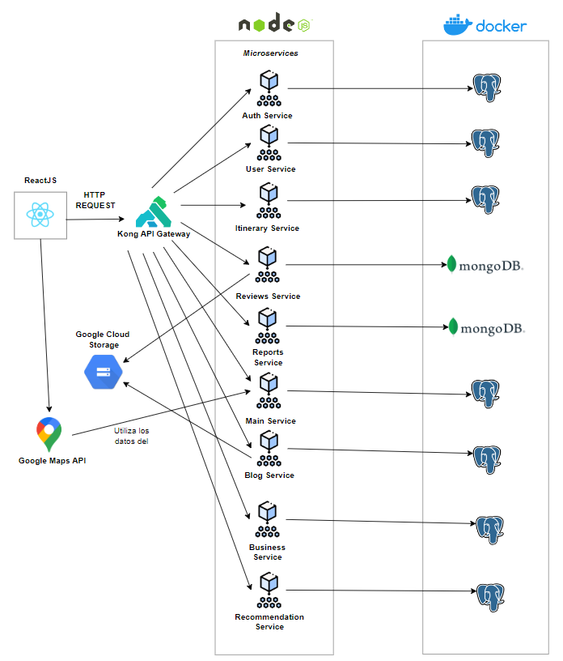

# 3.4. Mapeo entre elementos de Arquitectura

### Decisión: Elección del framework para el frontend de Turi

**Título**:  
- Elección entre ReactJS y .NET para el frontend.

**Contexto**:  
- El equipo de desarrollo de Turi tiene experiencia mixta, donde algunos desarrolladores tienen conocimiento en **.NET** y la mayoría tiene más experiencia en **ReactJS**. Se debe seleccionar el framework que mejor soporte la construcción de una plataforma ágil, escalable y con una interfaz dinámica y responsiva. El frontend de Turi deberá manejar interacciones complejas de usuarios y visualizaciones personalizadas de itinerarios de viaje.

**Alternativas**:  
1. **ReactJS**  
   - Popular y ampliamente adoptado en la comunidad de desarrollo frontend.
   - Permite crear interfaces de usuario interactivas y dinámicas.
   - Tiene un ecosistema robusto con muchas bibliotecas y herramientas para el desarrollo rápido de UI.
   - La mayoría del equipo tiene experiencia en ReactJS, lo que facilita el desarrollo y mantenimiento a largo plazo.
   
2. **.NET (Blazor)**  
   - Blazor es parte del ecosistema de .NET, permite usar C# para construir aplicaciones web.
   - Algunos miembros del equipo están familiarizados con .NET, lo que puede facilitar la integración con backend basado en .NET.
   - Menos adoptado para desarrollo frontend comparado con ReactJS.
   - Requiere más recursos de aprendizaje y adaptación para aquellos no familiarizados con Blazor.

**Criterios de Elección**:  
- Familiaridad del equipo con el framework.
- Velocidad de desarrollo e iteración.
- Soporte y ecosistema de herramientas disponibles.
- Escalabilidad y capacidad de crear interfaces de usuario altamente interactivas.

**Decisión**:  
- Se elige ReactJS.

**Sustento**:  
- La decisión se inclina hacia ReactJS debido a la experiencia mayoritaria del equipo en este framework, lo que permite un desarrollo más rápido y eficiente. Además, ReactJS tiene una comunidad más grande y un ecosistema más maduro, con herramientas y bibliotecas que aceleran el desarrollo de aplicaciones dinámicas. Aunque algunos miembros del equipo conocen .NET, el uso de ReactJS permite mantener un entorno más ágil y centrado en JavaScript, que también será útil para la integración con el backend basado en Node.js.

## Decisión: Elección entre AWS API Gateway y Kong API Gateway para la Arquitectura General de Turi
  
**Contexto:**  
Turi es una plataforma que debe gestionar múltiples APIs para diversas funciones, desde el manejo de itinerarios de viaje hasta la gestión de comentarios y usuarios. Es crucial elegir una solución de gateway que facilite la integración de los servicios existentes, garantice la seguridad, sea escalable y permita una gestión eficiente de las APIs a lo largo del tiempo. La elección se centra entre dos opciones: AWS API Gateway y Kong API Gateway.

**Alternativas:**   
- AWS API Gateway
   - Servicio gestionado que facilita la creación, implementación y monitoreo de APIs.
   - Se integra directamente con otros servicios de AWS como Lambda, IAM, y CloudWatch.
   - Ofrece autenticación, monitoreo y escalabilidad automáticas.
  - Tiene un costo basado en el uso y puede volverse caro a medida que aumenta el tráfico.
  
- Kong API Gateway
   - Plataforma de API Gateway de código abierto y auto-gestionada, con un fuerte enfoque en la personalización.
   - Proporciona un alto grado de control sobre el enrutamiento, autenticación, monitoreo y otras políticas API.
  - Es agnóstico en la nube, lo que permite implementaciones tanto on-premise como en diferentes proveedores de nube.
   - Tiene un conjunto de plugins que permiten agregar funcionalidades de manera flexible. 

**Criterios de Elección:**  
- Escalabilidad y Capacidad de Manejar Tráfico: La habilidad de la solución para escalar de manera eficiente conforme Turi crece y debe manejar grandes volúmenes de solicitudes simultáneas.

- Integración con Servicios Existentes: Compatibilidad y facilidad de integración con la infraestructura actual y los servicios que ya están en uso en la plataforma.

- Flexibilidad y Personalización: Grado de control que la solución ofrece sobre las políticas de acceso, autenticación, monitoreo y otros aspectos técnicos clave.

- Facilidad de Gestión y Mantenimiento: Facilidad de implementación, administración y mantenimiento continuo de la solución, incluyendo la reducción de la carga técnica para el equipo.

- Costos Operacionales y a Largo Plazo: Modelo de costos, considerando el presupuesto de Turi y los gastos proyectados en función del crecimiento y la demanda de la plataforma.

**Decisión:**  

Se elige **Kong API Gateway** como la solución para gestionar las APIs en Turi.

**Sustento:**

Kong ofrece mayor flexibilidad y personalización para una plataforma en crecimiento como Turi. Su capacidad para adaptarse a múltiples entornos, junto con su enfoque en el código abierto, permite mantener los costos bajo control mientras ofrece una solución robusta y escalable. La naturaleza auto-gestionada de Kong, junto con sus potentes herramientas de administración, proporciona un mayor control sobre la infraestructura, lo cual es clave para Turi en su plan de expansión. Aunque AWS API Gateway ofrece una solución gestionada y escalable, los costos y la dependencia de un solo proveedor no son ideales para la visión a largo plazo de la plataforma Turi.

## Descripción de Arquitectura

### Frontend (ReactJS):
El frontend de la aplicación está desarrollado con ReactJS y es responsable de la interfaz de usuario (UI). Este cliente envía solicitudes HTTP utilizando una REST API a través de Kong API Gateway para interactuar con los distintos microservicios del backend. La elección de ReactJS permite crear una experiencia de usuario dinámica, altamente interactiva y eficiente, gracias a su arquitectura basada en componentes y la capacidad de gestionar el estado de la aplicación de forma efectiva
### Kong API Gateway:
El Kong API Gateway se utiliza para gestionar todas las solicitudes entre el frontend y los microservicios del backend. Este componente cumple una función clave en la arquitectura, ya que no solo enruta las solicitudes entrantes, sino que también añade capas adicionales de seguridad y gestión, como autenticación, autorización mediante JWT, balanceo de carga, y administración de rutas hacia los diferentes microservicios. Esto asegura que la arquitectura sea robusta y escalable, protegiendo los datos y facilitando la comunicación fluida entre el frontend y los microservicios.
### Microservicios definidos:
- Cada microservicio corre en su propio entorno en contenedores de Docker y tiene responsabilidades específicas. Todos los microservicios están desarrollados con Node.js.
- Los servicios están divididos según funciones específicas del sistema, lo que permite una arquitectura flexible y escalable.
- Todos se comunican con los demás a través de peticiones HTTP.

  1. **Auth Service:** Responsable de la autenticación de usuarios. Se integra con el sistema de autorización mediante JWT. Los datos de autenticación, como credenciales y tokens, se almacenan en una base de datos PostgreSQL.
  2. **User Service:** Gestiona la información y perfil de los usuarios. Accede a una base de datos PostgreSQL para manejar la información personal y otros datos asociados a los usuarios.
  3. **Itinerary Service:** Maneja los itinerarios creados por los usuarios. También está respaldado por PostgreSQL, ya que se centra en datos estructurados como los viajes, las actividades planeadas, y las interacciones del usuario.
  4. **Reviews Service:** Encargado de gestionar las reseñas y comentarios de los usuarios. Usa una base de datos MongoDB, lo cual es adecuado para manejar datos no estructurados o semi-estructurados como las reseñas, imágenes, y otros elementos multimedia.
  5. **Admin Service:** Proporciona funcionalidades de administración, como gestión de usuarios, moderación de contenido, etc. También usa PostgreSQL.
  6. **Reports Service:** Este servicio se encarga de manejar los reportes realizados por los usuarios en la plataforma. Está conectado a MongoDB para manejar grandes volúmenes de datos.
  7. **Main Service:** Este servicio es clave para gestionar datos relacionados con los locales y las ubicaciones geográficas que se muestran en el mapa. Obtiene y maneja los datos de latitud y longitud de los locales para enviarlos al frontend y mostrarlos en el mapa. Utiliza PostgreSQL para gestionar estos datos estructurados, probablemente relacionados con los detalles de los negocios y sus ubicaciones.
  8. **Blog Service:** Permite a los usuarios crear, leer y comentar en los blogs. Las imágenes y videos asociados a las publicaciones se almacenan también en Google Cloud Storage.
  9. **Business Service:** Este servicio está dirigido a las empresas asociadas. Les permite ver reportes sobre las interacciones de los usuarios con sus locales y analizar el rendimiento de sus negocios en la plataforma. Los datos, como el número de visitas o ventas, se almacenan en una base de datos PostgreSQL.
  10. **Recommendation Service:** Este es parte del servicio premium de la plataforma. Está basado en las preferencias y el comportamiento de los usuarios, y genera recomendaciones personalizadas en base a ellas.

### Bases de Datos:
- **PostgreSQL:** Utilizada en los módulos de reseñas y comentarios, y el módulo de itinerarios, ya que estos datos no son necesariamente estructurados y pueden requerir flexibilidad en el esquema.
- **MongoDB:** Utilizado en servicios que requieren mayor flexibilidad en el almacenamiento de datos, como en el Reviews Service (para manejar reseñas y comentarios con imágenes o videos) y el Reports Service (para generar reportes basados en grandes cantidades de datos no estructurados o semi-estructurados).

### Flujo de Datos para el Mapa:
El Main Service obtiene la información de los restaurantes, actividades, sitios arqueológicos, etc., incluyendo sus coordenadas de latitud y longitud desde la base de datos PostgreSQL. Esta información es enviada al frontend mediante una solicitud HTTP y el front la utiliza para integrar y mostrar las ubicaciones en un mapa de Google Maps a través de la API de Google Maps. Los usuarios podran ver los lugares mas cercanos a su ubicacion en el mapa para una mayor experiencia de usuario y facilitar la busqueda de opciones a elegir en Turi para consumir los servicios ofrecidos.

### Google Cloud Storage:
Para el almacenamiento de archivos multimedia, como imágenes y videos que acompañan reseñas y publicaciones en blogs, se utiliza Google Cloud Storage. La ruta a estos archivos se guarda en las bases de datos para ser referenciada desde la aplicación. Esta estrategia permite un almacenamiento eficiente y escalable de grandes cantidades de datos multimedia.