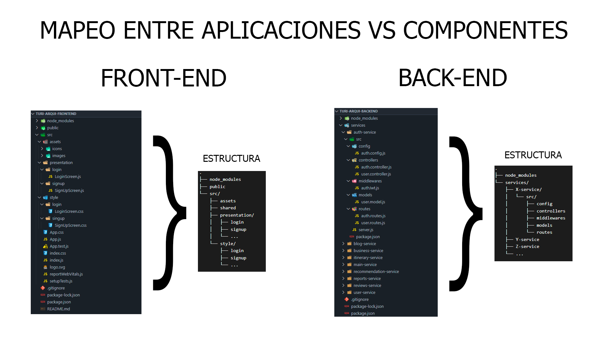

# 6.2. Mapeo Aplicaciones vs Componentes

**Descripción**

Para el backend, se está utilizando un monorepo que alberga los diferentes microservicios mencionados en el punto 3.4. Cada uno de estos microservicios contará con una estructura de carpetas similar a la del microservicio de auth-service, tal como se muestra en la imagen. Esta estructura incluye las siguientes carpetas:

- **config**: En esta carpeta se almacenan las configuraciones generales, que abarcan variables de entorno, configuraciones de base de datos, y archivos de configuración para servicios de terceros, entre otros.

- **controllers**: Aquí se encuentran los controladores, responsables de gestionar la lógica de negocio relacionada con las solicitudes HTTP.

- **middlewares**: Esta carpeta alberga los middlewares, que son funciones que se ejecutan entre la recepción de una solicitud y el envío de una respuesta.

- **models**: En esta sección se incluyen los modelos de datos, los cuales representan la estructura de las entidades en la aplicación y manejan la interacción con la base de datos.

- **routes**: Aquí se definen las rutas de la aplicación, es decir, las URLs que el servidor escucha, cada una de las cuales está asociada a un controlador específico.

Por otro lado, se ha realizado una primera implementación del microservicio de login, donde se ha aplicado el uso de JWT para la autenticación. Este token incluye información como el rol, el nombre de usuario y el ID del usuario.

En cuanto al frontend, se ha creado un proyecto de React con una estructura básica que distingue la capa de presentation, la cual contiene las vistas de la web, de otras carpetas como shared, destinada a componentes que se utilizan en múltiples vistas, y assets, que albergará todos los elementos visuales, como imágenes e íconos, que se emplearán a lo largo del proyecto. Además, se ha incorporado en index.css configuraciones básicas de colores de la web, incluyendo una paleta de colores y las interacciones del botón primario, con el objetivo de mantener buenas prácticas en cuanto al estilo. Para facilitar el orden, también se ha añadido una carpeta de styles, donde se organizarán los estilos de cada una de las vistas de forma separada.