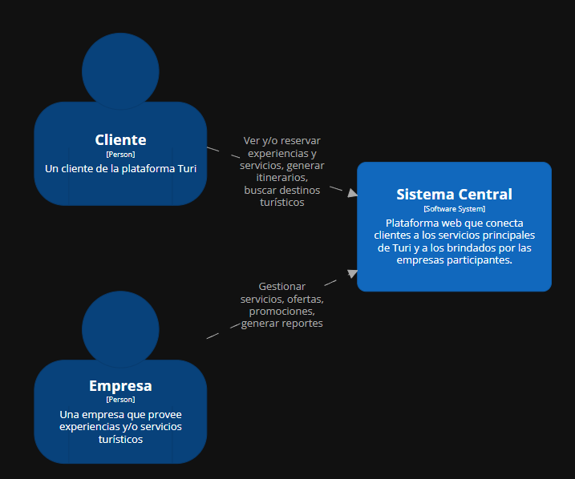
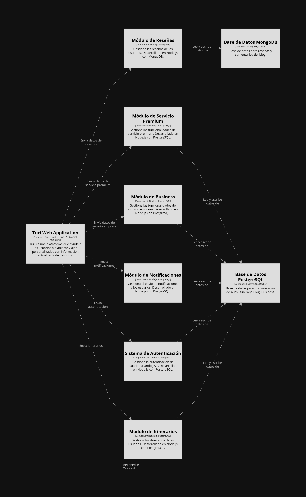

# 9.2. Iteración 1: Definir la estructura general del sistema

## 1. Objetivo de la iteración
Definir la estructura inicial y general de la plataforma web Turi.

## 2. Elegir elementos del sistema a refinar

### **Diagrama de contexto**

En el diagrama de contexto proporcionado, se visualiza la interacción entre los principales actores de la plataforma Turi, los cuales son Cliente, Empresa y Administrador, con los sistemas centrales que conforman la arquitectura de Turi: el Sistema Central de Turi y el Sistema de Administración de Turi.

## 3. Elegir conceptos de diseño que satisfacen el driver seleccionado

| Código  | Decisión de Diseño                                | Fundamentación                                                                                                                                                                                                                      |
|---------|---------------------------------------------------|------------------------------------------------------------------------------------------------------------------------------------------------------------------------------------------------------------------------------------|
| DEC-1   | Implementar una arquitectura basada en 3 capas    | La plataforma será implementada con una arquitectura basada en capas para facilitar el mantenimiento (QA-03, CRN01, CRN07) y la incorporación de nuevas funcionalidades (CRN07), así como la separación de responsabilidades (QA-03, CRN05). |
| DEC-2   | Implementar JSON Web Tokens (JWT) para la autenticación | Los JSON Web Tokens permiten implementar autenticación basada en estándares (CRN04), asegurando que las sesiones de usuario sean seguras (QA-02, QA-10) y escalables (CRN02). Esto facilita la comunicación entre el frontend y backend (CRN03), además de ser ampliamente compatible con arquitecturas de microservicios (CRN01, CRN07). |
| DEC-3   | Definición del sistema de módulos                             | Se establece la necesidad de diseñar el sistema de módulos para dividir responsabilidades funcionales de la plataforma, garantizando escalabilidad (CRN02, QA-04), mantenibilidad (QA-03), y un desarrollo modular eficiente (CRN07). |

## 4. Instanciar elementos de Arquitectura, asignar responsabilidades y definir interfaces

| Código  | Decisión de Diseño                                       | Fundamentación                                                                                                                                                                                                                                                                                          |
|---------|----------------------------------------------------------|----------------------------------------------------------------------------------------------------------------------------------------------------------------------------------------------------------------------------------------------------------------------------------------------------------|
| DEC-4   | Hacer uso de ReactJS para el frontend y Node.js con Express para el backend | ReactJS ofrece una interfaz de usuario interactiva, dinámica y eficiente (CRN05), mientras que Node.js con Express permite manejar peticiones del backend de manera rápida y eficiente (CRN03, QA-05). Esta combinación asegura una alta productividad del equipo (CRN03) y facilidad para el desarrollo (QA-03). |
| DEC-5   | Implementar MongoDB para servicios de Reseñas y Recomendaciones | MongoDB es una base de datos NoSQL ideal para manejar datos dinámicos y no estructurados como reseñas y recomendaciones (QA-03, QA-04, CU05, CU06, CU23, CU25). Su flexibilidad (CRN07) y capacidad para escalar horizontalmente (CRN06) hacen que sea la elección óptima para estos servicios, donde los esquemas pueden variar (QA-05). |
| DEC-6   | Implementar PostgreSQL para servicios de                 | PostgreSQL es una base de datos relacional que asegura integridad, consistencia y rendimiento para servicios que requieren transacciones rápidas y estructuradas, como autenticación, pagos y gestión de usuarios (QA-03, CRN04, CU01, CU02, CU03, CU27, CU29). Su soporte para consultas complejas y operaciones transaccionales (QA-05) garantiza un funcionamiento robusto y confiable (CRN06). |
| DEC-7   | Implementar las capas de frontend, backend y base de datos | Las capas de frontend, backend y base de datos se seleccionan para separar responsabilidades clave: el frontend gestiona la interacción del usuario (CRN05, QA-07), el backend centraliza la lógica de negocio y los servicios (QA-03, QA-05), mientras que la base de datos asegura el almacenamiento y acceso eficiente a la información (CRN06, QA-05). Esta división permite modularidad y escalabilidad específicas para cada capa según las necesidades del sistema (QA-08, CRN02). |
| DEC-8   | Definición de la estructura del JWT                      | La estructura del JWT definirá cómo se manejarán las credenciales de los usuarios de manera segura (QA-03, CRN04, CU01, CU02), incluyendo sus roles y tiempos de expiración. Esto asegura que cada interacción del usuario sea autenticada de manera eficiente (QA-05, CU03) y sin comprometer la seguridad (QA-10, CON04). |
| DEC-9   | 	Definición de los 10 módulos principales                      | Se identifican los módulos principales: Autenticación y Seguridad, Itinerario Personalizable, Recomendaciones, Reseñas y Comentarios, Blog, Servicios, Administración de Contenido, Analíticas, Reporte de Ingresos y Pagos (CRN01). Estos módulos responden a la necesidad de dividir responsabilidades funcionales (CRN05) y garantizar un desarrollo modular que permita crecimiento futuro (CRN07). |

## 5. Bosquejar vistas y registrar decisiones de diseño

## 6. Analizar el diseño actual, revisar objetivo de la iteración y logro del propósito del diseño

| **Elemento** | **No abordado** | **Parcialmente Abordado** | **Completamente Abordado** | **Decisión de diseño**                   |
|--------------|------------------|---------------------------|----------------------------|------------------------------------------|
| CU01         |                  |                           | ✔                          | DEC-2, DEC-6, DEC-8                      |
| CU02         |                  |                           | ✔                          | DEC-2, DEC-6, DEC-8                      |
| CU03         |                  | ✔                         |                            | DEC-2, DEC-8                             |
| CU04         |                  |                           | ✔                          | DEC-4, DEC-7, DEC-9                             |
| CU05         |                  | ✔                         |                            | DEC-5, DEC-9                                    |
| CU06         |                  | ✔                         |                            | DEC-5, DEC-7                             |
| CU07         |                  |                           | ✔                          | DEC-5, DEC-7                             |
| CU08         |                  |                           | ✔                          | DEC-5, DEC-7                             |
| CU09         |                  |                           | ✔                          | DEC-5, DEC-7                             |
| CU10         |                  |                           | ✔                          | DEC-4, DEC-7, DEC-9                             |
| CU11         |                  | ✔                         |                            | DEC-5, DEC-7                             |
| CU12         |                  | ✔                         |                            | DEC-5, DEC-7                             |
| CU13         |                  | ✔                         |                            | DEC-5, DEC-7                             |
| CU14         |                  |                           | ✔                          | DEC-4, DEC-7                             |
| CU15         |                  |                           | ✔                          | DEC-4, DEC-7                             |
| CU16         |                  |                           | ✔                          | DEC-4, DEC-7                             |
| CU17         |                  |                           | ✔                          | DEC-4, DEC-7                             |
| CU18         |                  |                           | ✔                          | DEC-4, DEC-7                             |
| CU19         |                  | ✔                         |                            | DEC-4, DEC-7                             |
| CU20         |                  | ✔                         |                            | DEC-4, DEC-7                             |
| CU21         |                  | ✔                         |                            | DEC-4, DEC-7                             |
| CU22         |                  |                           | ✔                          | DEC-4, DEC-7                             |
| CU23         |                  |                           | ✔                          | DEC-5, DEC-7, DEC-9                             |
| CU24         |                  |                           | ✔                          | DEC-5, DEC-7                             |
| CU25         |                  |                           | ✔                          | DEC-5, DEC-7                             |
| CU26         |                  |                           | ✔                          | DEC-5, DEC-7                             |
| CU27, DEC-9         | ✔                |                           |                            |                                          |
| CU28         | ✔                |                           |                            |                                          |
| CU29         |                  | ✔                         |                            | DEC-6, DEC-9                                    |
| QA01         |                  | ✔                         |                            | DEC-4, DEC-7                             |
| QA02         |                  | ✔                         |                            | DEC-2, DEC-8                             |
| QA03         |                  | ✔                         |                            | DEC-1, DEC-4, DEC-6                      |
| QA04         |                  |                           | ✔                          | DEC-5, DEC-7                             |
| QA05         |                  | ✔                         |                            | DEC-4, DEC-6, DEC-7                      |
| QA06         |                  |                           | ✔                          | DEC-5, DEC-7                             |
| QA07         |                  | ✔                         |                            | DEC-5, DEC-7                             |
| QA08         |                  | ✔                         |                            | DEC-5, DEC-7                             |
| QA09         |                  | ✔                         |                            | DEC-5, DEC-7                             |
| QA10         |                  |                           | ✔                          | DEC-2, DEC-8                             |
| QA11         |                  |                           | ✔                          | DEC-5, DEC-7                             |
| QA12         |                  |                           | ✔                          | DEC-1, DEC-5, DEC-6                             |
| QA13         |                  | ✔                           |                          | DEC-5, DEC-6                             |
| QA14         |                  |   ✔                          |                         | DEC-2, DEC-8                             |
| QA15         |                  |  ✔                           |                         | DEC-4, DEC-9                             |
| QA16         |                  |                           | ✔                          | DEC-7                            |
| QA17         |                  |    ✔                        |                          | DEC-1, DEC-9                             |
| QA18         |                  |     ✔                       |                          | DEC-6                            |
| QA19         |                  |                           | ✔                          | DEC-9                             |
| QA20         |                  |  ✔                           |                         | DEC-1, DEC-9                             |
| CON01        |                  |                           | ✔                          | DEC-5, DEC-7                             |
| CON02        | ✔                |                           |                            |                                          |
| CON03        | ✔                |                           |                            |                                          |
| CON04        |                  |                           | ✔                          | DEC-2, DEC-8                             |
| CON05        |                  | ✔                         |                            | DEC-5, DEC-7                             |
| CRN01        |                  |                           | ✔                          | DEC-1, DEC-2, DEC-7                      |
| CRN02        |                  | ✔                         |                            | DEC-7                                    |
| CRN03        |                  | ✔                         |                            | DEC-4                                    |
| CRN04        |                  | ✔                         |                            | DEC-2, DEC-8                             |
| CRN05        |                  | ✔                         |                            | DEC-4, DEC-7                             |
| CRN06        |                  | ✔                         |                            | DEC-5, DEC-7                             |
| CRN07        |                  | ✔                         |                            | DEC-1, DEC-5, DEC-7                      |
