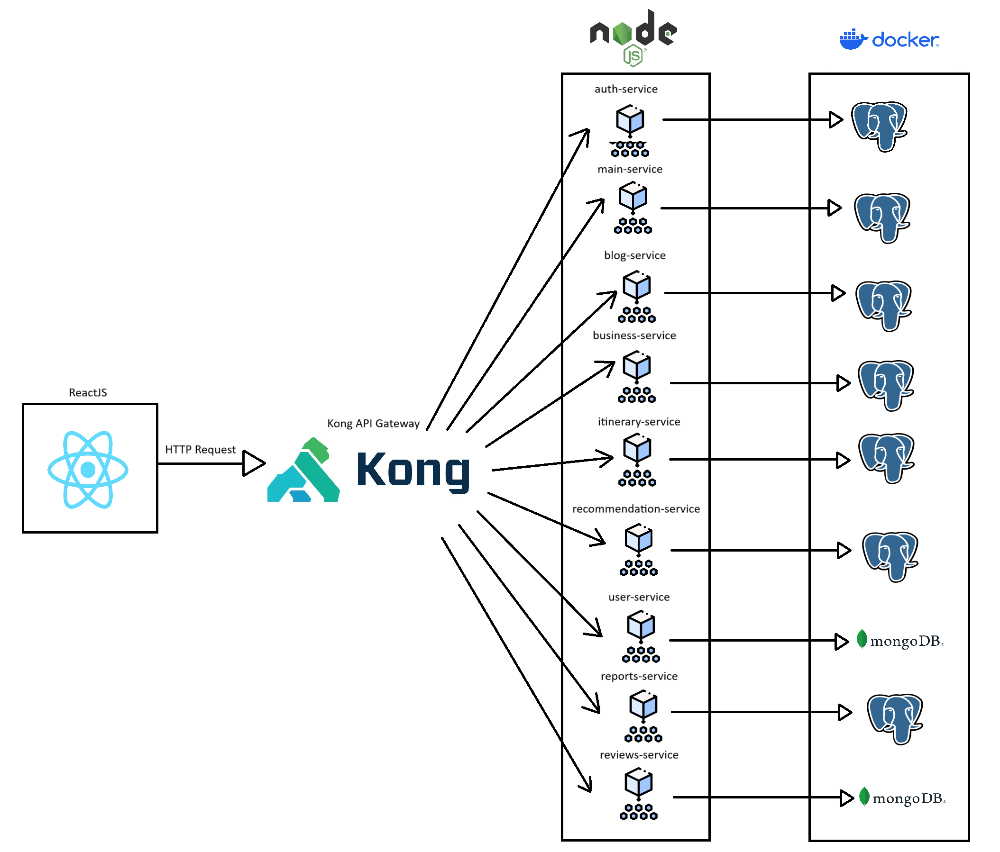

# 9.3. Iteración 2: Identificar estructuras para soportar la funcionalidad primaria

## 1. Objetivo de la iteración
Desarrollar y probar las funcionalidades iniciales de la plataforma Turi, priorizando los módulos de Autenticación y Seguridad, Itinerario Personalizable y Recomendaciones, para garantizar una base funcional del sistema.

## 2. Elegir elementos del sistema a refinar

### **Módulos priorizados**
1. **Autenticación y Seguridad:**
   - Manejo de usuarios y roles.
   - Integración de JWT para inicio de sesión seguro.
2. **Itinerario Personalizable:**
   - Creación, edición y visualización de itinerarios.
3. **Recomendaciones:**
   - Generación dinámica de recomendaciones basadas en historial del usuario.

## 3. Elegir conceptos de diseño que satisfacen el driver seleccionado

| Código  | Decisión de Diseño                            | Fundamentación                                                                                             |
|---------|-----------------------------------------------|-----------------------------------------------------------------------------------------------------------|
| DEC-10  | Configurar un sistema de roles basado en JWT  | Los roles permitirán gestionar el acceso a funcionalidades críticas del sistema (QA-03, CRN04, QA-10).   |
| DEC-11  | Implementar un sistema de plantillas para itinerarios | Facilita la creación y personalización rápida de itinerarios por los usuarios (CU09, QA-07, CRN07).       |
| DEC-12  | Usar algoritmos colaborativos para recomendaciones | Permite sugerencias personalizadas y mejora la experiencia del usuario (CU06, QA-05, QA-08, CRN07).       |

## 4. Instanciar elementos de Arquitectura, asignar responsabilidades y definir interfaces

| Código  | Decisión de Diseño                                  | Fundamentación                                                                                                         |
|---------|-----------------------------------------------------|-----------------------------------------------------------------------------------------------------------------------|
| DEC-13  | Crear servicios RESTful específicos para cada módulo | Separar las funcionalidades de Autenticación, Itinerario y Recomendaciones mejora el mantenimiento (QA-03, CRN02).     |
| DEC-14  | Desarrollar un sistema de caché para recomendaciones | Reducirá la carga del sistema al servir datos preprocesados (CRN02, QA-05, CRN07).                                     |
| DEC-15  | Definir endpoints para itinerarios y recomendaciones | Garantiza una interfaz clara para el frontend en el consumo de datos (CU09, CU23, QA-03).                              |

## 5. Bosquejar vistas y registrar decisiones de diseño

## 6. Analizar el diseño actual, revisar objetivo de la iteración y logro del propósito del diseño

| **Elemento** | **No abordado** | **Parcialmente Abordado** | **Completamente Abordado** | **Decisión de diseño**         |
|--------------|------------------|---------------------------|----------------------------|--------------------------------|
| CU06         |                  | ✔                         |                            | DEC-12, DEC-14                |
| CU09         |                  |                           | ✔                          | DEC-11, DEC-15                |
| CU23         |                  |                           | ✔                          | DEC-15                        |
| QA03         |                  | ✔                         |                            | DEC-10, DEC-13, DEC-15        |
| QA05         |                  | ✔                         |                            | DEC-13, DEC-14                |
| QA08         |                  |                           | ✔                          | DEC-12                        |
| CRN02        |                  | ✔                         |                            | DEC-13, DEC-14                |
| CRN04        |                  |                           | ✔                          | DEC-10                        |
| CRN07        |                  | ✔                         |                            | DEC-11, DEC-12, DEC-14        |
