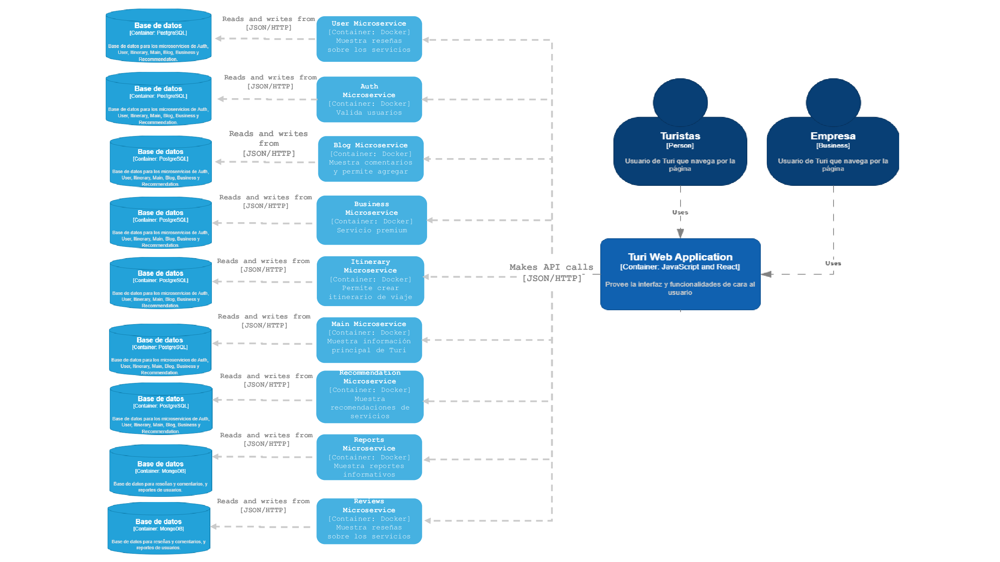
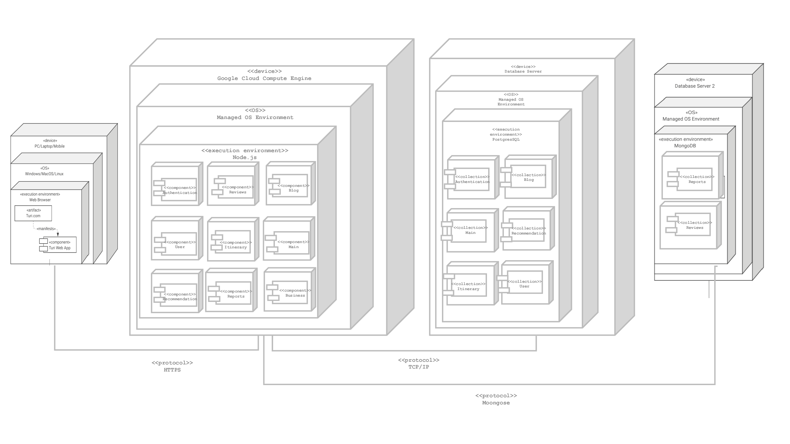

# 9.4. Iteración 3: Refinar estructuras para abordar el atributo de calidad más importante

## 1. Objetivo de la iteración
Definir las estructuras que permitan abordar los requerimientos del atributo de calidad de Mantenibilidad.

## 2. Elegir elementos del sistema a refinar
Como se busca cumplir con el atributo de Mantenibilidad a lo largo de toda la web, los principales elementos a considerar son los módulos y el frontend de Turi.

## 3. Elegir conceptos de diseño que satisfacen el driver seleccionado
| Código  | Decisión de Diseño| Fundamentación|
|---------|-------------------|---------------|
| DEC-1 | Incrementar coherencia semántica entre módulos | Hay responsabilidades en el sistema como la de autenticación que no siguen el mismo propósito para todos los módulos, por lo que la mejor decisión es separlos en módulos diferentes. Ejem: Teniendo un módulo encargado netamente de la autenticación. (QA-04, CRN01, CRN07) |
| DEC-2 | Uso de un intermediario entre el cliente y el servidor | Al utilizarse una API Gateway, esto permite manejar microservicios que no tengan dependencia entre sí. (QA-04, QA-17, CRN07) |
| DEC-3 | Uso de APIs definidas para cada microservicio | Cada microservicio tiene una APIs encargada de encapsular una lógica específica y acceder a su propia base de datos para romper la dependencia con otros microservicios. (QA-17, CRN01, CRN07) | 
| DEC-4 | Refactorizar la autenticación | La lógica de autenticación se mantiene constante para todos los microservicios, pero esta no debe repetirse en todos por ser redundante. (QA-04, QA-17, CRN04) | 
| DEC-5 | Monitoreo de los servicios | Con motivo de identificar más rápidamente la raíz de algún posible problema, se requiere de algún tipo de monitoreo que agilice dicha operación. (QA-08, QA-11, CRN02) |
| DEC-6 | Mantener cohesión de lógica de negocio de creación de itinerarios | La plataforma debe manejar correctamente la lógica del negocio de permitir al usuario crear un itinerario, pero a la vez permitir que los usuarios premium puedan obtener recomendaciones personalizadas sin afectar toda la lógica del itinerario. (QA-04, QA-19, CRN07) | 
| DEC-7 | Encapsular estilos del frontend | Como el frontend puede variar en estilos dependiendo del branding de Turi, se debe tener una forma de encapsularlos en el frontend para garantizar una alta mantenbilidad en caso se requieran cambios. (QA-05, CRN05) |
| DEC-8 | Encapsulamiento del consumo de APIs en el frontend | Se debe separar la lógica de la vista con la del consumo de servicios, pues manejan responsabilidades diferentes. (QA-05, QA-17, CRN05, QA-20) |

## 4. Instanciar elementos de Arquitectura, asignar responsabilidades y definir interfaces
| Código  | Decisión de Diseño| Fundamentación|
|---------|-------------------|---------------|
| DEC-9 | Contenedores de Docker para cada microservicio | Se usará contenedores independientes de Docker implementando 2 capas de servicio y base de datos para cada microservicio, esto permitirá una escalabilidad horizontal donde cambios en un contenedor no afectarán al resto. (QA-12, QA-17, CRN01, CRN07) | 
| DEC-10 | Abstraer la lógica de autenticación en un módulo | Ya que se requiere de validación de los usuarios mediante token y a partir de este obtener el id de los usuarios, es un antipatrón de Mantenibilidad que se repita la lógica de autenticación para cada microservicio, por lo que este será un microservicio específicamente con esa responsabilidad. (QA-04, QA-17, CRN04) |
| DEC-11 | Monitoreo de los microservicio mediante endpoints de health checking | Se incluirá un endpoint de Health Checking Monitoring en cada uno de los microservicios, incluyendo detalles como uptime (tiempo que se encuentra activo) y response time (tiempo de respuesta), esto permitirá identificar más rápido si hay algún problema en la web porque solo se tiene que consultar al endpoint para saber que el microservicio donde se encuentra esté corriendo correctamente. (QA-08, QA-11, CRN02) |
| DEC-12 | Mantener los microservicios de itinerario y recomendaciones de forma separada | Debido a que las recomendaciones son exclusivas para usuarios premium, se requiere de que este módulo esté desacoplado de la creación de itinerario pese a estar fuertemente relacionados, esto facilita la mantenbilidad de ambos microservicios porque no se afectan entre sí. Además, en caso de requerir cambios en la lógica de negocio de las recomendaciones, este se agilizar al tratarlo como un módulo independiente. (QA-04, QA-19, CRN07) |
| DEC-13 | Creación de estilos globales en la raíz del proyecto | Encapsular colores y estilos globales para reutilizarse a lo largo de todo el proyecto y esto facilita el cambio de sus valores cuando se requiera, además de evitar el código repetido en los CSS del proyecto. (QA-05, CRN05) |
| DEC-14 | Gestionar el consumo de APIs de forma centralizada | Encapsular la lógica del consumo de APIs en el frontend en módulos diferentes y reutilizables que maneje las diferentes configuraciones y/o manejo de errores, en lugar de tener peticiones directas en la vista. Esto también permite manejar el consumo de diferentes servicios a lo largo de todo el proyecto, refactorizando la lógica de forma que, en caso se requiera, se pueda hacer la petición en diferentes vistas del frontend sin necesidad de duplicar código ni asignarle responsabilidades que no le corresponde a la vista. (QA-05, QA-17, CRN05, CRN07) |

## 5. Bosquejar vistas y registrar decisiones de diseño

**Diagrama de contenedores**

**Diagrama de Despliegue**

## 6. Analizar el diseño actual, revisar objetivo de la iteración y logro del propósito del diseño

| **Elemento** | **No abordado** | **Parcialmente Abordado** | **Completamente Abordado** | **Decisión de diseño**                   |
|--------------|------------------|---------------------------|----------------------------|------------------------------------------|
| CU01  |          |          | ✔           | DEC-2, DEC-6, DEC-8, DEC-13  |
| CU02   |         |          | ✔           | DEC-2, DEC-6, DEC-8, DEC-13  |
| CU03         |                  | ✔                         |                            | DEC-2, DEC-8, DEC-13                     |
| CU04         |                  |                           | ✔                          | DEC-4, DEC-7, DEC-9, DEC-12              |
| CU05         |                  | ✔                         |                            | DEC-5, DEC-9, DEC-12                     |
| CU06         |                  | ✔                         |                            | DEC-5, DEC-7, DEC-12                     |
| CU07         |                  |                           | ✔                          | DEC-5, DEC-7, DEC-12                     |
| CU08         |                  |                           | ✔                          | DEC-5, DEC-7, DEC-12                     |
| CU09         |                  |                           | ✔                          | DEC-5, DEC-7, DEC-12                     |
| CU10         |                  |                           | ✔                          | DEC-4, DEC-7, DEC-9, DEC-12              |
| CU11         |                  | ✔                         |                            | DEC-5, DEC-7, DEC-12                     |
| CU12         |                  | ✔                         |                            | DEC-5, DEC-7, DEC-12                     |
| CU13         |                  | ✔                         |                            | DEC-5, DEC-7, DEC-12                     |
| CU14         |                  |                           | ✔                          | DEC-4, DEC-7, DEC-10                     |
| CU15         |                  |                           | ✔                          | DEC-4, DEC-7, DEC-10                     |
| CU16         |                  |                           | ✔                          | DEC-4, DEC-7, DEC-10                     |
| CU17         |                  |                           | ✔                          | DEC-4, DEC-7, DEC-10                     |
| CU18         |                  |                           | ✔                          | DEC-4, DEC-7, DEC-10                     |
| CU19         |                  | ✔                         |                            | DEC-4, DEC-7, DEC-10                     |
| CU20         |                  | ✔                         |                            | DEC-4, DEC-7, DEC-10                     |
| CU21         |                  | ✔                         |                            | DEC-4, DEC-7, DEC-10                     |
| CU22         |                  |                           | ✔                          | DEC-4, DEC-7, DEC-10                     |
| CU23         |                  |                           | ✔                          | DEC-5, DEC-7, DEC-9, DEC-11              |
| CU24         |                  |                           | ✔                          | DEC-5, DEC-7, DEC-11                     |
| CU25         |                  |                           | ✔                          | DEC-5, DEC-7, DEC-11                     |
| CU26         |                  |                           | ✔                          | DEC-5, DEC-7, DEC-11                     |
| CU27         | ✔                |                           |                            | DEC-4, DEC-7, DEC-9                      |
| CU28         | ✔                |                           |                            | DEC-4, DEC-6, DEC-14                     |
| CU29         |                  | ✔                         |                            | DEC-6, DEC-9, DEC-14                     |
| QA01         |                  | ✔                         |                            | DEC-4, DEC-7, DEC-11                     |
| QA02         |                  | ✔                         |                            | DEC-2, DEC-8, DEC-13                     |
| QA03         |                  | ✔                         |                            | DEC-1, DEC-4, DEC-6, DEC-10              |
| QA04         |                  |                           | ✔                          | DEC-5, DEC-7, DEC-10                     |
| QA05         |                  | ✔                         |                            | DEC-4, DEC-6, DEC-7, DEC-14              |
| QA06         |                  |                           | ✔                          | DEC-5, DEC-7, DEC-11                     |
| QA07         |                  | ✔                         |                            | DEC-5, DEC-7, DEC-11                     |
| QA08         |                  | ✔                         |                            | DEC-5, DEC-7, DEC-11                     |
| QA09         |                  | ✔                         |                            | DEC-5, DEC-7, DEC-11                     |
| QA10         |                  |                           | ✔                          | DEC-2, DEC-8, DEC-13                     |
| QA11         |                  |                           | ✔                          | DEC-5, DEC-7, DEC-11                     |
| QA12         |                  |                           | ✔                          | DEC-1, DEC-5, DEC-6, DEC-11              |
| QA13         |                  | ✔                         |                            | DEC-5, DEC-6, DEC-11                     |
| QA14         |                  | ✔                         |                            | DEC-2, DEC-8, DEC-13                     |
| QA15         |                  | ✔                         |                            | DEC-4, DEC-9, DEC-14                     |
| QA16         |                  |                           | ✔                          | DEC-7, DEC-10                            |
| QA17         |                  |                          | ✔                           | DEC-1, DEC-9, DEC-14                     |
| QA18         |                  | ✔                         |                            | DEC-6, DEC-9, DEC-14                     |
| QA19         |                  |                           | ✔                          | DEC-9, DEC-14                            |
| QA20         |                  |                          | ✔                           | DEC-1, DEC-9, DEC-14                     |
| CON01        |                  |                           | ✔                          | DEC-5, DEC-7, DEC-11                     |
| CON02        | ✔                |                           |                            | DEC-6, DEC-12                            |
| CON03        | ✔                |                           |                            | DEC-6, DEC-12                            |
| CON04        |                  |                           | ✔                          | DEC-2, DEC-8, DEC-13                     |
| CON05        |                  | ✔                         |                            | DEC-5, DEC-7, DEC-11                     |
| CRN01        |                  |                           | ✔                          | DEC-1, DEC-2, DEC-7                      |
| CRN02        |                  | ✔                         |                            | DEC-7, DEC-11                            |
| CRN03        |                  | ✔                         |                            | DEC-4, DEC-9                             |
| CRN04        |                  | ✔                         |                            | DEC-2, DEC-8, DEC-13                     |
| CRN05        |                  | ✔                         |                            | DEC-4, DEC-7                             |
| CRN06        |                  | ✔                         |                            | DEC-5, DEC-7, DEC-11                     |
| CRN07        |                  | ✔                         |                            | DEC-1, DEC-5, DEC-7                      |
