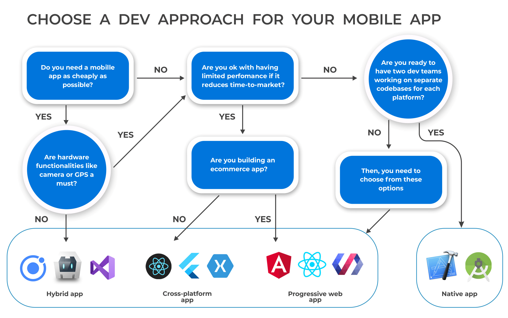

# ARQUITECTURAS DE APLICACIONES MÓVILES: Nativas vs Híbridas vs Multiplataforma


## Desarollo conceptual
### 1. Arquitecturas de aplicaciones

El desarrollo de aplicaciones móviles se encuentra en constante evolución y crecimiento, por lo que diversas discusiones emergen. Una de estas discusiones a raíz de un mundo de desarrollo de aplicaciones móviles saturado es: ¿Cuál es la mejor arquitectura móvil a implementar? ¿Debe ser una app móvil, híbrida o multiplataforma?. Para este cuestionamiento no existe una respuesta exacta, pues depende mucho de la organización, los líderes de negocios y los desarrolladores a cargo. Lo que se adapta mejor a una organización, no necesariamente es lo que necesite otra.

Bajo esta primicia, es primordial comprender lo que es cada de una de estas arquitecturas a nivel conceptual, sus ventajes y desventajas, y los frameworks existentes.


**1.1. Nativas**  
Las aplicaciones nativas están desarrolladas para una plataforma móvil específica usando el lenguaje de programación de dicha plataforma. Permiten que el funcionamiento sea bueno porque están optimizados para el sistema operativo del dispositivo, tanto a nivel de software como de hardware (cámara, sensores, geolocalización). Además, permiten que la UX a nivel de look and feel sea más fluida.

Principalmente las aplicaciones nativas están desarrolladas para funcionar en Android y iOS, permitiendo un algo nivel de adecación a la plataforma. 
- Android: Java o Kotlin.
- iOS: Objective-C o Swift.

#### Ventajas
- **Rendimiento**
  - Brindan rapidez y alto rendimiento porque están optimizadas para la plataforma para la que se desarrolla.
- **Menors bugs**
  - Al tener control de un proyecto destinado a una sola plataforma, se tiene mejor control de todos los aspectos de la app y permite reducir los bugs en comparación a utiliza aplicaciones híbridas o multiplataforma.
- **Calidad de UX**
  - Permiten realizar interfaces más intuitivas y fluidas con la ayuda de frameworks que siguen los lineamientos de la plataforma, además de poder acceder a sus controles y layouts.
- **Accesibilidad a opciones nativas**
  - Pueden acceder e interactar con todas las funcionalidades del dispositivo, teniendo un mejor control de ellos al ser nativo y basado para funcionar en su sistema operativo.
- **Seguridad**
  - Se tiene acceso a características built-in que permiten implmentar seguridad en las aplicaciones como la detección de fraude y encriptación de datos, además de estar menos vulnerable que apps híbridas que trabajan muchas veces sobre WebViews.
#### Desventajas
- **Código no reutilizable**
  - Al ser desarrolladas para una plataforma específica, se requiere desarrollar la misma app pero para otras plataformas en caso se requiera. 
    - Ejem: Si desarrollo una app Android y luego deseo también hacerla para iOS, se debe hacer la aplicación nativamente para iOS desde cero.
- **Costos de mantenimiento**
  - Los costos suelen ser mayores para aplicaciones nativas.
- **Costo de tiempo**
  - Si se requieren aplicaciones nativas para distintas plataformas, se debe llevar a cabo un desarrollo separado para cada una, lo cual incrementa el tiempo de desarrollo y también impacta en los costos monetarios del mismo.

**1.2. Híbridas**  
Las aplicaciones híbridas están desarrolladas utilizando tecnologías web como HTML, CSS y Javascript, esto permite que se desarrollen aplicaciones para múltiples plataformas con un solo desarrollo. Estas aplicaciones corren sobre aplicaciones nativas compatibles con el sistema operativo donde de descarga y funciona mediante WebViews.

Los WebViews ejecutan contenido web dentro de la aplicación pero sin utilizar una URL visible. Este contenido web se ve adaptado en una interfaz igual que una aplicación nativa.
- Ionic

#### Ventajas
- **Desarrollo rápido**
  - Se utiliza un solo proyecto para desarrollar una sola aplicación que pueda funcionar en diferentes plataformas, pues no depende de características nativas de dispositivos.
- **Mantenibilidad**
  - Al basarse en tecnologías web, su mantenimiento es más rápido y sencillo porque no requiere de código complejo.
- **UX/UI**
  - Integra las beneficios de interfaces nativas y webs.
- **Launches**
  - Subir actualizaciones y patches a la aplicación es más sencillo que aplicaciones nativas. Se pueden subir aplicaciones en tiendas de apps o en la web.
- **Costos**
  - Los costos de desarrollar aplicaciones híbridas son menores a las nativas, pues se ahorra tiempo y dinero en producir una aplicación que puede funcionar para diversos usuarios independientemente del sistema operativo de su dispositivo, requiriendo solo un desarrollo.
- **Mayor alcance**
  - Al ser desarrolladas para funcionar en diferentes plataformas, permiten captar a mayor cantidad de usuarios y ser instaladas en múltiples dispositivos con diferentes sistemas operativos.
- **Acceso inmediato**
  - Pueden ser descargadas por links, no solo mediante tiendas de apps.
#### Desventajas
- **Bajo control del dispositivo**
  - Las aplicaciones híbridas tienen limitado acceso a opciones del dispositivo como la cámara o geolocalización, por lo general se requiere de plugins.
- **Inconsistencia de SO**
  - Hay opciones del dispositivo que puede variar dependiendo del sistema operativo, lo cual requiere de un desarrollo más meticuloso en cuanto a implementación con el uso de ciertas características del equipo en la app.
- **Limitaciones de performance**
  - Suponen una mayor carga para el hardware del dispositivo, lo cual puede provocar daños. El mal rendimiento afecta la velocidad y fluidez de las interfaces, pero también afecta tiempos de respuesta, precisión de la pantalla y control de gestos.
- **Depuración y fallas**
  - Al estar desarrolladas para múltiples plataformas, encontrar y limpiar código resulta tedioso porque se deben cuidar errores contemplado los diferentes casos dependiendo de las diferentes plataformas, lo que conlleva a realizar pruebas más seguido. Pese a esto, las fallas se pueden detectar muchas veces cuando ya han sido instaladas.

**1.3. Multiplataforma**

Son aplicaciones que utilizan un único código base para generar aplicaciones nativas para diferentes sistemas operativos, como Android e iOS. Esto se logra a través de frameworks que permiten compilar código nativo en cada plataforma, pues el código se convierte al lenguaje nativo del sistema operativo.

Si bien es cierto que su concepto suena similar a las aplicaciones híbridas, en el caso de las multiplataforma no dependen de WebViews, por lo que el rendimiento y la seguridad es mayor. Además, son lo más cercano a aplicaciones nativas porque se cuenta con frameworks que permiten el acceso a funcionalidades nativas.

- React Native
- Flutter
- Xamarin
  
#### Ventajas
- **Único código reutilizable**
  - Se hace el desarrollo con un solo código que luego es convertido al lenguaje nativo del dispositivo donde se está instalando.
- **Buen mantenimiento**
  - Al solo tener un código, el testing y deployment de fixes a producción o de actualizaciones se convierte en algo más fácil, pues los cambios se verán reflejados de manera simultánea en todas las plataformas.
- **Mayor alcance**
  - Abarcar con un solo código múltiples plataformas permite un mayor alcance de llegada en el mercado, lo que aumenta la popularidad de negocios como startups que requieren de crecimiento rápido.
- **Costos**
  - Producen menores costos de desarrollo y de mantenimiento a largo plazo.
- **Acceso a funciones nativas**
  - Los frameworks utilizados para su desarrollo cuentan con complementos para funciones nativas de la plataforma.

#### Desventajas
- **Limitaciones de rendimiento**
  - Estas limitaciones pueden ocurrir por el tipo de tecnologías a utilizar, si se requiere de funcionalidades muy específicas de una plataforma en particular ya no será la mejor opción.
- **Dependencia de terceros**
  - Al requerir de frameworks, estos pueden tener sus propias limitaciones y actualizaciones periódicas. Si el proveedor deja de dar soporte, esto afectaría la estabilidad y funcionalidad de la aplicación.


### TOMA DE DECISIÓN
Depende mucho del tipo de aplicación que se necesite según el negocio. A continuación, se muestra un diagrama base de cómo poder decidir cuál arquitectura es la que mejor se adecua:  


Fuente: https://railsware.com/blog/native-vs-hybrid-vs-cross-platform/

## 2. Consideraciones técnicas

### **Escenario**
> El escenario de esta Demo implica la creación de una aplicación básica, siguiendo el patrón de arquitectura MVVM, que permite ingresar un número de días de viaje. Esto generará una lista por cada uno de los días indicados y se podrá seleccionar entre una lista de opciones.  

> Se hará uso de la cámara en ambos dispositivos para tomar fotos y mostrarlas en pantalla. Manejo de permisos de cámara.

### **Requisitos previos** 
Para efectos del presente trabajo, se requerirán de las siguientes instalaciones:

### 2.1. Aplicación nativa
#### Paso 1: Se requiere instalar Android Studio en su versión más actual estable
https://developer.android.com/studio?hl=es-419 
#### Paso 2: Crear un Empty Project
  

#### Paso 3: Asignarle nombre al proyecto


#### Paso 4: Dependencias
En el ```build.gradle.kts (:app)``` se deben agregar las siguientes dependencias para poder hacer una navegación, usar inyección de dependencias (DI) y ViewModels
```
    // ViewModel
    implementation("androidx.lifecycle:lifecycle-viewmodel-ktx:2.8.6")
    implementation("androidx.lifecycle:lifecycle-livedata-ktx:2.8.6")
    implementation("androidx.lifecycle:lifecycle-viewmodel-compose:2.8.6")

    // Dagger Hilt
    implementation( "com.google.dagger:hilt-android:2.49")
    kapt("com.google.dagger:hilt-android-compiler:2.43.2")
    implementation("androidx.hilt:hilt-navigation-compose:1.0.0")

    implementation("androidx.navigation:navigation-compose:2.6.0")
```

### 2.2. Aplicación multiplataforma
#### Paso 1: Instalar el SDK de Flutter  
https://docs.flutter.dev/get-started/install
#### Paso 2: Instalar VScode
https://code.visualstudio.com/download 
#### Paso 3: Crear el proyecto
  

<h3>Seleccionar el template "Application"  </h3>  

  

#### Paso 4: Estructura de carpetas
  

En la estructura se pueden ver carpetas para diferentes sistemas operativos en específico, los cuales son: Android, iOS, MacOS, Linux y Windows. Esta estructura es parte de la ventaja de las aplicaciones multiplataforma, puesto permiten realizar desarrollo para estos sistemas operativos en caso se requiera de alguna configuración especial para alguno de estos SO. Por ejemplo, en el caso de esta demo, se requiere de añadir unos permisos en la carpeta de iOS para el uso de la cámara (luego se explicará dónde), pero en el caso de Android no.

Esto permite realizar desarrollos cercanos a lo que podría ser un desarrollo nativo, pero dentro de las ventajas que ofrece el desarrollo de aplicaciones multiplataforma.

#### Paso 5: Dependencias

1. **Device Preview**
> Se utilizará un plugin llamado Device Preview que permite ver la aplicación en diferentes dispositivos iOS, Android, MacOS, Windows y Linux
- Se debe instalar el plugin device_preview -> https://pub.dev/packages/device_preview 
```
> flutter pub add device_preview
```
En caso no aparezca la dependencia en el archivo ``` pubspec.yaml  ```, se debe hacer un upgrade de las dependencias con el siguiente comando:
```
> flutter pub upgrade
``` 
Al requerir utilizar el package del plugin, se debe agregar al encabezado del código el siguiente import:
```
import 'package:device_preview/device_preview.dart';
``` 
  
2. **Image Picker**
> Se utilizará una dependencia llamada Image Picker para permitir el uso de la cámara en los dispositivos Android y iOS
- Se debe instalar image_picker -> https://pub.dev/packages/image_picker

En el caso de iOS, se requiere ingresar la siguiente configuración en el archivo ``` Info.plist ```
```
  <key>NSCameraUsageDescription</key>
	<string>Used to demonstrate image picking plugin<string>
	<key>NSMicrophoneUsageDescription</key>
	<string>Used to capture audio from image picker plugin</string>
	<key>NSPhotoLibraryUsageDescription</key>
	<string>Used to demonstrate image picker plugin</string>
```

Se instala con el siguiente comando:
```
> flutter pub add image_picker
```

Al requerir utilizar el package del plugin, se debe agregar al encabezado del código el siguiente import:
```
import 'package:image_picker/image_picker.dart';
```

## Se puede utilizar un emulador para realizar las pruebas
#### Paso 1: Creación de un dispositivo en el Device Manager de Android Studio


#### Paso 2: Selección del equipo Android a emular  

De preferencia, al crear un emulador es mejor uno que tenga la Play Store  

#### Paso 3: Selección de la versión de Android

En caso de no tener la API Version de Android instalada, se requerirá su instalación  

#### Paso 4: Configuraciones extras del emulador
 
Se pueden incluir configuraciones extras como de rendimiento, el acceso al tipo de cámara virtual, la conexión a internet del emulador y demás.  


## 3. Demo

Link de la demo: https://youtu.be/F3v4ipfx_Uw


### Fuentes
- https://www.microsoft.com/en-us/power-platform/products/power-apps/topics/app-development/native-vs-cross-platform-apps
- https://www.inspiringapps.com/blog/120/app-development-native-vs-hybrid-vs-cross-platform/
- https://www.netsolutions.com/insights/native-vs-hybrid-vs-cross-platform/
- https://movadex.com/blog/article/native-vs-hybrid-vs-cross-platform-vs-pwa-a-comprehensive-comparison
- https://turingpoint.de/en/blog/native-or-hybrid-app-which-is-more-secure/
- https://www.techtarget.com/searchsoftwarequality/definition/hybrid-application-hybrid-app
- https://www.appsflyer.com/glossary/hybrid-app/
- https://bambu-mobile.com/
- https://ionic.io/resources/articles/what-is-hybrid-app-developmentventajas-y-desventajas-de-las-apps-hibridas/
- https://www.cutedigitalmedia.com/blog/desarrollo-de-aplicaciones-multiplataforma-ventajas-y-desventajas/
- https://ed.team/blog/apps-nativas-vs-apps-multiplaformas