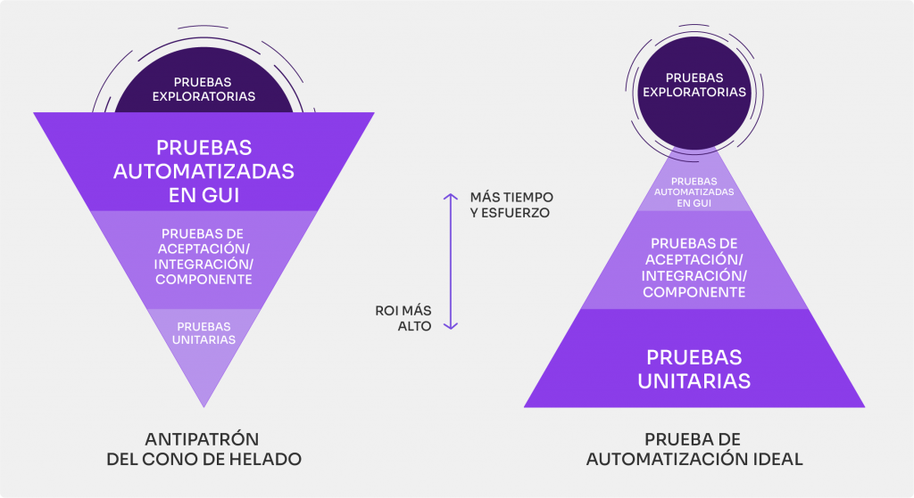
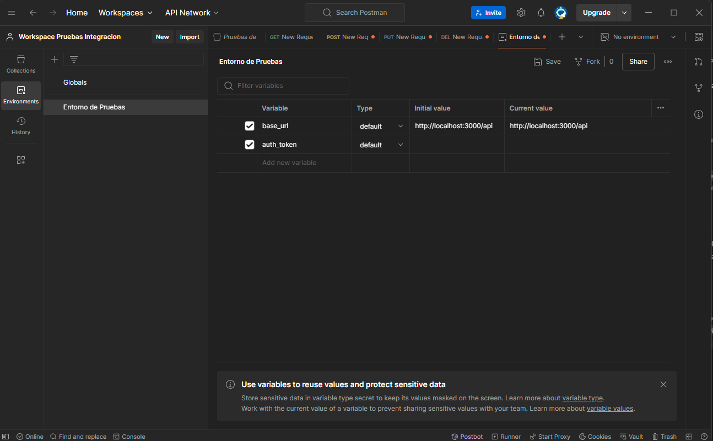
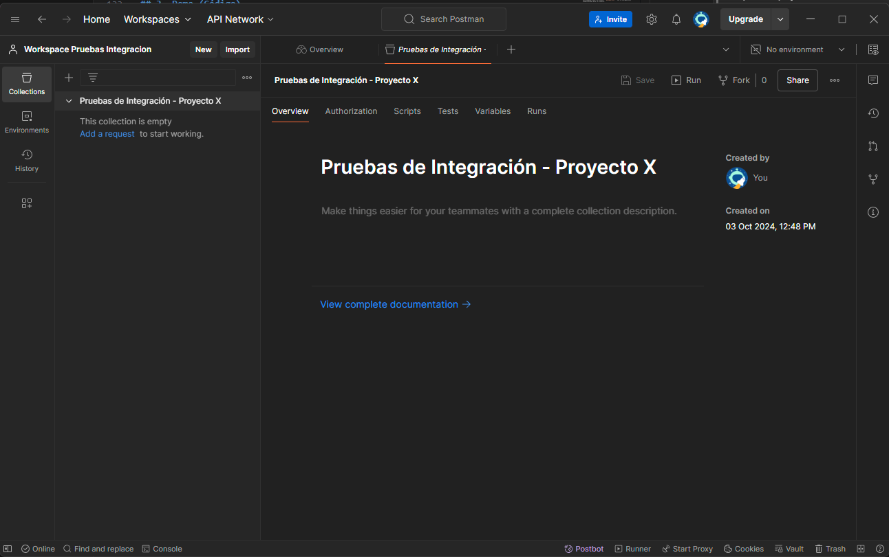
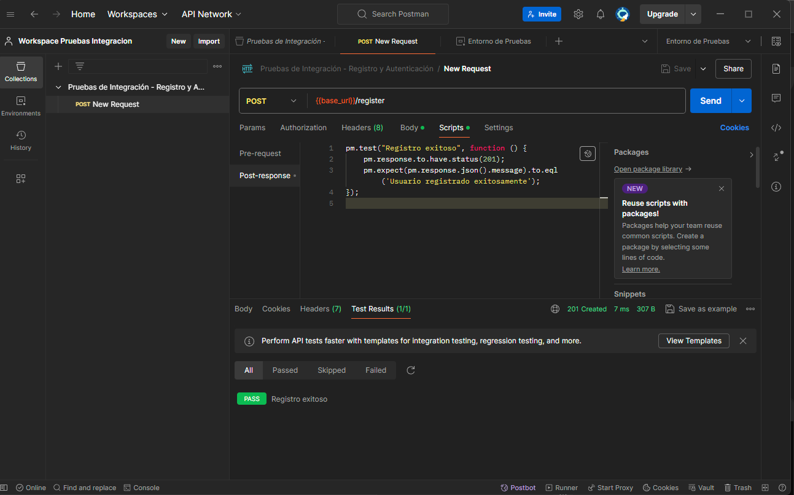

# Comparación entre Pruebas de Integración y Pruebas Unitarias usando Postman

## 1. Desarrollo Conceptual

### 1.1. ¿Qué son las pruebas de integración?
Las pruebas de integración son un tipo de pruebas de software que se realizan para verificar la interacción entre diferentes módulos o componentes del sistema. Su objetivo principal es identificar problemas en las interfaces y en la interacción entre unidades individuales, asegurándose de que el sistema completo funcione de manera cohesionada. Estas pruebas permiten verificar que los diferentes módulos se integren correctamente y que no existan problemas al combinar distintas partes de la aplicación.

Por ejemplo, si se tienen un módulo de autenticación y un módulo de gestión de usuarios, las pruebas de integración buscarán asegurar que los usuarios puedan autenticarse y luego realizar acciones que dependen de su perfil de usuario. Esto permite comprobar que las dependencias entre ambos módulos funcionen como se espera.

### 1.2. ¿Qué son las pruebas unitarias?
Las pruebas unitarias, por otro lado, son pruebas que se enfocan en verificar el funcionamiento correcto de las unidades más pequeñas del código, típicamente funciones o métodos individuales. Estas pruebas aseguran que cada unidad funcione de manera aislada y cumpla con los requerimientos esperados.

A diferencia de las pruebas de integración, las pruebas unitarias se centran en la lógica interna del componente sin considerar su interacción con otros módulos. Por ejemplo, si se tiene una función de "calcularDescuento", se realizarán pruebas unitarias para confirmar que el descuento sea correcto para diferentes valores de entrada.



### 1.3. Comparación entre Pruebas Unitarias y de Integración
| Aspecto                | Pruebas Unitarias                              | Pruebas de Integración                      |
|------------------------|-----------------------------------------------|--------------------------------------------|
| **Propósito**          | Validar el funcionamiento de componentes individuales. | Verificar la interacción correcta entre módulos. |
| **Cobertura**          | Muy detallada, enfocada en una función específica. | Amplia, cubriendo múltiples módulos y su interacción. |
| **Ventajas**           | Rápidas de ejecutar, fáciles de aislar fallos. | Permiten identificar problemas de comunicación entre componentes. |
| **Desventajas**        | No garantizan el funcionamiento del sistema completo. | Pueden ser más complejas y lentas de ejecutar. |

Ambos tipos de pruebas son complementarias y esenciales para asegurar la calidad del software.

### 1.4. ¿Qué es la Integración Continua (CI)?

La **Integración Continua (CI)** es una práctica de desarrollo de software que consiste en integrar continuamente los cambios de código en un repositorio central compartido, donde se ejecutan automáticamente pruebas para detectar errores lo antes posible. Esto se hace varias veces al día para asegurar que cualquier modificación que se haga en el código no afecte el funcionamiento del sistema de forma inesperada.

En el contexto de las pruebas de software, la Integración Continua juega un papel fundamental, ya que permite que las pruebas unitarias e integraciones se ejecuten automáticamente cada vez que hay un cambio en el código, ayudando a mantener la calidad y estabilidad del software a lo largo del proceso de desarrollo.

#### Beneficios de la Integración Continua:

1. **Detección temprana de errores**: Al ejecutar pruebas automáticamente con cada cambio en el código, los errores se identifican y corrigen más rápido.
2. **Automatización de pruebas**: Tanto las pruebas unitarias como las de integración se ejecutan de forma automatizada, eliminando la necesidad de hacerlas manualmente y garantizando consistencia.
3. **Integración frecuente y fluida**: CI facilita la integración de pequeños cambios frecuentes, lo que reduce el riesgo de problemas al combinar grandes volúmenes de código de una sola vez.
4. **Retroalimentación rápida**: Los desarrolladores reciben retroalimentación inmediata sobre el impacto de sus cambios, lo que acelera el proceso de depuración.

## 2. Consideraciones Técnicas

### 2.1. Herramientas Utilizadas

#### Framework de Pruebas Unitarias (Jest)
**Jest** es un framework de pruebas para JavaScript que permite definir y ejecutar pruebas automatizadas para verificar que cada componente del sistema se comporte de manera esperada. Es ideal para las pruebas unitarias ya que es fácil de configurar y ofrece una sintaxis clara para escribir pruebas.

Características clave:
- **Instalación sencilla**: Se puede instalar como una dependencia de desarrollo mediante `npm install jest --save-dev`.
- **Pruebas rápidas**: Permite ejecutar pruebas unitarias de forma aislada para asegurar la funcionalidad de pequeñas porciones del código.
- **Integración con Node.js**: Jest se utiliza junto con Node.js, facilitando la automatización y el uso de módulos de JavaScript.

#### Postman para Pruebas de Integración
**Postman** es una herramienta ampliamente utilizada para realizar pruebas de integración de APIs. Permite definir y ejecutar solicitudes HTTP para verificar que los servicios respondan correctamente y que la interacción entre múltiples endpoints sea la adecuada.

Características clave:
- **Colecciones**: Agrupación de solicitudes relacionadas para realizar pruebas más organizadas.
- **Variables de Entorno**: Utilizadas para manejar diferentes configuraciones, como URLs de pruebas y de producción.
- **Pruebas Automáticas**: Postman permite escribir scripts para automatizar la validación de las respuestas.

#### Postman y Newman para Pruebas de Integración Continua
Para incluir las pruebas de Postman en un proceso de Integración Continua (CI), se puede utilizar Newman, la CLI (Command Line Interface) de Postman. Newman permite ejecutar colecciones de Postman desde la línea de comandos, lo que facilita su integración en herramientas de CI como Jenkins, GitHub Actions, GitLab CI, y otras plataformas de CI/CD.

**Beneficios de usar Postman y Newman en CI:**
- **Automatización total**: Las pruebas de Postman se ejecutan automáticamente en cada cambio de código o despliegue, verificando que las APIs funcionen correctamente en todo momento.
- **Pruebas paralelas**: Se pueden ejecutar múltiples colecciones o escenarios en paralelo, lo que optimiza el tiempo de ejecución en grandes sistemas.
- **Reportes detallados**: Newman ofrece opciones para generar reportes en varios formatos (HTML, JSON, XML), lo que permite obtener feedback claro y detallado sobre los resultados de las pruebas.


### 2.2. Diseño de las Pruebas

#### Pruebas Unitarias
- **Caso de Prueba 1**: Probar la función `calcularDescuento` con diferentes valores de entrada.
- **Estructura**: 
  - Se utiliza Jest para verificar la salida esperada de la función `calcularDescuento` con diferentes entradas.
  - Se evalúan casos límite (e.g., descuentos del 0% y del 100%) para garantizar la cobertura completa de la lógica.
  - Por ejemplo, una prueba verifica que al aplicar un descuento del 10% a un precio de 100, el resultado es 90, mientras que otra prueba valida que un descuento del 100% resulte en 0.

```javascript
// archivo: descuento.test.js

const calcularDescuento = require('./descuento');

test('Debe calcular correctamente el descuento del 10% de un precio de 100', () => {
  const precio = 100;
  const porcentaje = 10;
  const resultadoEsperado = 90;

  const resultado = calcularDescuento(precio, porcentaje);

  expect(resultado).toBe(resultadoEsperado);
});
```
- **Detalles Técnicos**: 
  - Jest facilita la ejecución rápida de pruebas de cada unidad para garantizar que la lógica del sistema funcione como se espera.
   - Utilizando ```expect``` y ```toBe```, Jest permite comparar la salida obtenida con la esperada, asegurando así la fiabilidad de cada componente aislado.

#### Pruebas de Integración
- **Caso de Prueba 2**: Verificar que el módulo de autenticación se comunique correctamente con el módulo de gestión de usuarios.
- **Estructura**: 
  - Se realizan solicitudes HTTP desde Postman, donde primero se obtiene un token de autenticación y luego se utiliza para realizar una operación sobre los datos de usuario.
- **Detalles Técnicos**: 
  - Se valida el código de estado de la respuesta (e.g., `200 OK`).
   - Se verifica la estructura de la respuesta con JSON schema.
   - Por ejemplo, se envía una solicitud de autenticación para obtener un token, y luego ese token se utiliza para acceder a los datos de un usuario, asegurando que ambos módulos interactúan correctamente.

```json
   {
  "method": "POST",
  "url": "{{base_url}}/auth/login",
  "body": {
    "username": "testUser",
    "password": "password123"
  },
  "tests": {
    "status code should be 200": "pm.response.to.have.status(200);",
    "token should exist": "pm.expect(pm.response.json().token).to.be.a('string');"
  }
}
```

#### Extra: Uso de Variables de Entorno y Pre-request Scripts en Postman

1. **Configuración de Variables de Entorno:**

- Postman permite definir variables de entorno para reutilizar valores clave como la `base_url` y `auth_token`. Esto permite cambiar entre entornos de pruebas y producción de manera más sencilla.

2. **Uso de Pre-request Scripts:**
- Antes de enviar una solicitud, Postman puede ejecutar scripts de JavaScript conocidos como "Pre-request Scripts". Estos scripts son útiles para generar datos dinámicos. Por ejemplo, podrías necesitar generar un `auth_token` antes de acceder a un endpoint protegido.

**Ejemplo de Pre-request Script para Generar un Token Dinámicamente:**
```javascript
// Este script se ejecutará antes de la solicitud para establecer el token de autenticación
pm.sendRequest({
  url: pm.environment.get("base_url") + "/auth/login",
  method: 'POST',
  header: {
    'Content-Type': 'application/json'
  },
  body: {
    mode: 'raw',
    raw: JSON.stringify({
      "username": "testUser",
      "password": "password123"
    })
  }
}, function (err, res) {
  if (!err) {
    var jsonData = res.json();
    pm.environment.set("auth_token", jsonData.token);
  }
});
```
Este script realiza una solicitud para obtener un token y lo guarda en una variable de entorno (`auth_token`) que luego se usará en las siguientes solicitudes.

#### Pruebas de Integración con Servicios de Pago

Al integrar servicios de pago como **Stripe**, es importante validar que la aplicación maneje correctamente las transacciones. Las pruebas de integración deben garantizar que se cree correctamente un `PaymentIntent` y que el sistema gestione adecuadamente las respuestas del servicio de pago.

- **Caso de Prueba 3**: Validar que el sistema cree correctamente un `PaymentIntent` utilizando el servicio de **Stripe**.
- **Estructura**:
  - Se envía una solicitud HTTP al endpoint de la API del backend que hemos configurado para **Stripe**.
  - El endpoint del backend utiliza la API de **Stripe** para crear un `PaymentIntent`.
  - Se valida que la respuesta incluya un `client_secret` y que el código de estado sea `200 OK`.

```javascript
// Stripe: Endpoint para crear un PaymentIntent
app.post('/create-payment-intent', async (req, res) => {
  const { amount } = req.body;

  try {
    // Crea un PaymentIntent con el monto especificado
    const paymentIntent = await stripe.paymentIntents.create({
      amount: amount,
      currency: 'usd',
      payment_method_types: ['card']
    });

    res.json({ clientSecret: paymentIntent.client_secret });
  } catch (error) {
    res.status(500).json({ error: error.message });
  }
});
```

En este caso, se simula una transacción a través de **Stripe** y se verifica que el sistema reciba correctamente el `client_secret` para confirmar el pago en la interfaz del cliente.

#### Pruebas de Integración con Redes Sociales

Para permitir la autenticación mediante **Facebook**, el sistema debe recibir y validar un `access_token` para obtener la información del usuario. Las pruebas de integración deben asegurar que el backend pueda recuperar correctamente los datos del usuario desde **Facebook**.

- **Caso de Prueba 4**: Validar la autenticación con **Facebook** mediante el `access_token`.
- **Estructura**:
  - Se envía una solicitud HTTP al endpoint del backend con el `access_token` de **Facebook**.
  - El backend utiliza este token para solicitar información del usuario desde la API de **Facebook**.
  - Se verifica que la respuesta contenga la información correcta del usuario, como su nombre y correo electrónico.

```javascript
// Facebook: Endpoint para obtener información del usuario con access_token
app.post('/facebook-login', async (req, res) => {
  const { access_token } = req.body; // En lugar de recibir el code, recibes el access_token directamente

  try {
    // Usar el access_token para obtener la información del usuario
    const userResponse = await axios.get('https://graph.facebook.com/me', {
      params: {
        access_token: access_token,
        fields: 'name,email'
      }
    });

    res.json(userResponse.data);
  } catch (error) {
    res.status(500).json({ error: error.message });
  }
});
```

Este ejemplo muestra cómo el sistema utiliza el `access_token` proporcionado por **Facebook** para recuperar los datos del usuario y verificar que la autenticación sea exitosa.

#### Pruebas Automatizadas con Newman y CI en Windows

Para automatizar las pruebas de integración en un entorno local de **Windows**, se utiliza **Newman** para ejecutar colecciones de **Postman**. El **Programador de Tareas (Task Scheduler)** se configura para ejecutar las pruebas a intervalos regulares o en función de eventos.

##### Prueba CI con Newman en Windows

En este caso, configuramos un pipeline de CI local en **Windows** utilizando **Newman**. Las pruebas de integración se automatizan ejecutando un script `.bat` a través del **Programador de Tareas**.

- **Caso de Prueba 5**: Ejecutar automáticamente la colección de **Postman** utilizando **Newman** en un entorno local de **Windows**.
- **Estructura**:
  - Se crea un archivo `.bat` con el siguiente contenido para ejecutar la colección exportada de **Postman**:

```bat
@echo off
:: Instalar Newman si no está instalado
npm install -g newman

:: Ejecutar la colección de Postman
newman run C:\ruta\a\your_collection.json -e C:\ruta\a\your_environment.json --reporters cli
```

- Luego, este archivo se programa en el **Programador de Tareas** para que se ejecute automáticamente a intervalos regulares, simulando un entorno de **CI**.

---

## 3. Demo (Código)

Link de la demo: https://youtu.be/wqiQUN3zREs

### 3.1. Pruebas Unitarias
### 3.1.1. Configuración del Entorno para las Pruebas Unitarias

Para realizar pruebas unitarias en JavaScript, primero es necesario configurar un entorno adecuado utilizando Node.js y Jest. A continuación, se describen los pasos para realizar esta configuración.

#### Paso 1: Instalar Node.js y npm
Primero, nos aseguraremos de tener Node.js y npm instalados en nuestra computadora. Podemos descargar Node.js (que incluye npm) desde [su sitio web oficial](https://nodejs.org/).

Para verificar la instalación, ejecutaremos los siguientes comandos en la terminal:
```bash
node -v
npm -v
```
Esto mostrará la versión instalada de Node.js y npm respectivamente.

#### Paso 2: Crear un Proyecto Node.js
Crearemos una carpeta para nuestro proyecto y navega a ella en la terminal:
```bash
mkdir pruebas-unitarias
cd pruebas-unitarias
```
Inicializazamos un proyecto Node.js con el siguiente comando:
```bash
npm init -y
```
Este comando creará un archivo ```package.json``` con la configuración predeterminada para nuestro proyecto.

#### Paso 3: Instalar Jest
Jest es una herramienta popular para realizar pruebas unitarias en JavaScript. Lo instalaremos como una dependencia de desarrollo:
```bash
npm install jest --save-dev
```

Para configurar Jest como el framework de pruebas, agregaremos la siguiente sección en tu package.json:

```bash
"scripts": {
  "test": "jest"
}
```
Esto permitirá ejecutar todas las pruebas simplemente usando el comando ```npm test```.

### 3.1.2. Crear el Código Fuente y la Prueba Unitaria

#### Paso 4: Crear el Código de la Función (descuento.js)

Crea un archivo llamado ```descuento.js``` que contendrá la lógica del cálculo del descuento:
```javascript
// archivo: descuento.js

function calcularDescuento(precio, porcentaje) {
  if (precio < 0 || porcentaje < 0 || porcentaje > 100) {
    throw new Error('Los valores de precio y porcentaje deben ser positivos, y el porcentaje debe estar entre 0 y 100');
  }
  return precio - (precio * (porcentaje / 100));
}

module.exports = calcularDescuento;

```

Este código implementa la función ```calcularDescuento``` que recibe un precio y un porcentaje de descuento, y retorna el precio con el descuento aplicado. También contiene validaciones para evitar valores inválidos.

#### Paso 5: Crear el Archivo de Pruebas (```descuento.test.js```)

Crea un archivo llamado ```descuento.test.js``` para las pruebas unitarias:

```javascript
// archivo: descuento.test.js

const calcularDescuento = require('./descuento');

test('Debe calcular correctamente el descuento del 10% de un precio de 100', () => {
  const precio = 100;
  const porcentaje = 10;
  const resultadoEsperado = 90;

  const resultado = calcularDescuento(precio, porcentaje);

  expect(resultado).toBe(resultadoEsperado);
});

test('Debe devolver el precio original si el porcentaje es 0', () => {
  const precio = 100;
  const porcentaje = 0;
  const resultadoEsperado = 100;

  const resultado = calcularDescuento(precio, porcentaje);

  expect(resultado).toBe(resultadoEsperado);
});

test('Debe devolver 0 si el porcentaje es 100', () => {
  const precio = 100;
  const porcentaje = 100;
  const resultadoEsperado = 0;

  const resultado = calcularDescuento(precio, porcentaje);

  expect(resultado).toBe(resultadoEsperado);
});

test('Debe lanzar un error si el precio es negativo', () => {
  const precio = -100;
  const porcentaje = 10;

  expect(() => calcularDescuento(precio, porcentaje)).toThrow('Los valores de precio y porcentaje deben ser positivos, y el porcentaje debe estar entre 0 y 100');
});

test('Debe lanzar un error si el porcentaje es mayor a 100', () => {
  const precio = 100;
  const porcentaje = 110;

  expect(() => calcularDescuento(precio, porcentaje)).toThrow('Los valores de precio y porcentaje deben ser positivos, y el porcentaje debe estar entre 0 y 100');
});

test('Debe lanzar un error si el porcentaje es negativo', () => {
  const precio = 100;
  const porcentaje = -10;

  expect(() => calcularDescuento(precio, porcentaje)).toThrow('Los valores de precio y porcentaje deben ser positivos, y el porcentaje debe estar entre 0 y 100');
});

```
Este archivo contiene las pruebas unitarias para la función ```calcularDescuento```, incluyendo varios escenarios para asegurar que la función maneje correctamente los casos normales y los casos límite.

### 3.1.3. Ejecutar las Pruebas

Para ejecutar las pruebas unitarias, simplemente utiliza el siguiente comando en la terminal:
```bash
npm test
```
Jest buscará automáticamente todos los archivos que terminen en ```.test.js``` y ejecutará las pruebas que estén definidas en ellos.

Si todas las pruebas pasan, deberías ver algo como lo siguiente:
```plaintext
PASS  ./descuento.test.js
✓ Debe calcular correctamente el descuento del 10% de un precio de 100 (5ms)
✓ Debe devolver el precio original si el porcentaje es 0 (2ms)
✓ Debe devolver 0 si el porcentaje es 100 (3ms)
✓ Debe lanzar un error si el precio es negativo (1ms)
✓ Debe lanzar un error si el porcentaje es mayor a 100 (1ms)
✓ Debe lanzar un error si el porcentaje es negativo (1ms)
```

### 3.2. Pruebas de Integración con Postman

#### Paso 1: Descargar e Instalar Postman
1. **Acceder al Sitio Oficial**:
   - Ir al sitio web oficial de Postman: [https://www.postman.com/downloads/](https://www.postman.com/downloads/).
2. **Seleccionar la Plataforma**:
   - Elegir la versión adecuada para tu sistema operativo (Windows, Mac, Linux).
3. **Instalar**:
   - Descargar el instalador y seguir las instrucciones en pantalla para instalar Postman.

#### Paso 2: Configuración Inicial de Postman
1. **Crear una Cuenta**:
   - Al abrir Postman por primera vez, se te pedirá que crees una cuenta o inicies sesión. Esto no es obligatorio para usar Postman, pero se recomienda para guardar colecciones en la nube.
2. **Entorno de Trabajo**:
   - Crear un "Workspace" para organizar tus colecciones de solicitudes.

#### Paso 3: Crear el Proyecto Node.js y la API

Antes de realizar las pruebas de integración, necesitamos crear una API que permita el registro y la autenticación de usuarios. Vamos a crear un entorno Node.js básico con una API para probar estos flujos.
1. **Crear el Entorno de Node.js**:
   ```bash
   mkdir api-pruebas-integracion
   cd api-pruebas-integracion
   npm init -y
   ```

2. **Instalar Dependencias Necesarias**:

- Vamos a instalar algunas dependencias clave para la API: Express para el servidor, y JSON Web Token (JWT) para manejar la autenticación.
   ```bash
   npm install express jsonwebtoken body-parser
   npm install nodemon --save-dev
   ```
3. **Crear la API (`index.js`) Crea un archivo llamado `index.js` con el siguiente contenido:**:
   ```javascript
   const express = require('express');
   const jwt = require('jsonwebtoken');
   const bodyParser = require('body-parser');

   const app = express();
   app.use(bodyParser.json());

   const SECRET_KEY = 'mi_clave_secreta';

   // Registro de usuario (Simulación)
   app.post('/api/register', (req, res) => {
   const { username, password } = req.body;
   if (username && password) {
      res.status(201).json({ message: 'Usuario registrado exitosamente', username });
   } else {
      res.status(400).json({ message: 'Datos inválidos' });
   }
   });

   // Login de usuario y generación de token
   app.post('/api/login', (req, res) => {
   const { username, password } = req.body;
   if (username === 'testUser' && password === 'password123') {
      const token = jwt.sign({ username }, SECRET_KEY, { expiresIn: '1h' });
      res.status(200).json({ token });
   } else {
      res.status(401).json({ message: 'Credenciales inválidas' });
   }
   });

   // Endpoint protegido
   app.get('/api/protected', (req, res) => {
   const token = req.headers['authorization']?.split(' ')[1];
   if (!token) {
      return res.status(403).json({ message: 'Token requerido' });
   }

   jwt.verify(token, SECRET_KEY, (err, user) => {
      if (err) {
         return res.status(403).json({ message: 'Token inválido' });
      }
      res.status(200).json({ message: 'Acceso permitido', user });
   });
   });

   // Iniciar el servidor
   app.listen(3000, () => {
   console.log('Servidor ejecutándose en http://localhost:3000');
   });
   ```
4. **Ejecutar el servidor**:

```bash
   npx nodemon index.js
   ```


#### Paso 4: Configuración de las Pruebas en Postman
#### Paso 4.1: Crear Variables de Entorno
1. **Crear Variables de Entorno**:
   - Navegar a "Environments" y crear un nuevo entorno llamado "Entorno de Pruebas".
   - Agregar las siguientes variables:

      - `base_url`: `http://localhost:3000/api`
      - `auth_token`: (Dejar vacío inicialmente)

   

#### Paso 4.2: Crear la Colección de Pruebas
1. **Crear una Nueva Colección**:
   - Haz clic en "Collections" en el panel izquierdo y luego en "New Collection".
   - Nombrar la colección como "Pruebas de Integración - Registro y Autenticación".
   
#### Paso 4.3: Crear las Solicitudes

1. **Registro de Usuario**:
   - Dentro de la colección, crea una nueva solicitud `POST` a `{{base_url}}/register`.
   - **Body**: Selecciona `raw` y elige `JSON` como tipo de contenido.
   ```json
      {
      "username": "testUser",
      "password": "password123"
      }
   ```
   - **Pruebas Automáticas**: Selecciona `raw` y elige `JSON` como tipo de contenido.
   ```javascript
      pm.test("Registro exitoso", function () {
         pm.response.to.have.status(201);
         pm.expect(pm.response.json().message).to.eql('Usuario registrado exitosamente');
      });

   ```
   


2. **Autenticación de Usuario (Login)**:
- Crear una nueva solicitud `POST` a `{{base_url}}/login`.
- **Body**: Selecciona `raw` y elige `JSON` como tipo de contenido.
   ```json
   {
   "username": "testUser",
   "password": "password123"
   }
   ```
- **Pruebas Automáticas**:
   ```javascript
   pm.test("Login exitoso", function () {
   pm.response.to.have.status(200);
   pm.expect(pm.response.json().token).to.be.a('string');
   });

   // Guardar el token de autenticación en el entorno
   var jsonData = pm.response.json();
   pm.environment.set("auth_token", jsonData.token);
   ```

3. **Endpoint Protegido**:
- Crear una solicitud `GET` a `{{base_url}}/protected`.
- **Headers**:
   - `Authorization`: `Bearer {{auth_token}}`
- **Pre-request Script**:
   - Asegurarse de que el token esté disponible:
   ```javascript
   if (!pm.environment.get("auth_token")) {
      pm.sendRequest({
      url: pm.environment.get("base_url") + "/login",
      method: 'POST',
      header: {
         'Content-Type': 'application/json'
      },
      body: {
         mode: 'raw',
         raw: JSON.stringify({
         "username": "testUser",
         "password": "password123"
         })
      }
      }, function (err, res) {
         if (!err) {
            var jsonData = res.json();
            pm.environment.set("auth_token", jsonData.token);
         }
      });
   }

   ```

   - **Pruebas Automáticas**:
   ```javascript
   pm.test("Acceso permitido", function () {
      pm.response.to.have.status(200); // Verifica que el código de estado sea 200

      // Obtener el cuerpo de la respuesta
      var jsonData = pm.response.json();

      // Verificar que el mensaje sea "Acceso permitido"
      pm.expect(jsonData.message).to.eql('Acceso permitido');

      // Verificar que el campo 'user' exista y tenga un username correcto
      pm.expect(jsonData.user).to.be.an('object');
      pm.expect(jsonData.user.username).to.eql('testUser');
   });
   ```

   #### Paso 5: Ejecutar la Colección
   - Selecciona la colección "Pruebas de Integración - Registro y Autenticación".
   - Haz clic en Run (Ejecutar) para ejecutar todas las solicitudes en secuencia.
   - Verificación: Postman ejecutará todas las solicitudes de manera ordenada:
      - Primero registrará al usuario.
      - Luego autenticará al usuario y almacenará el `auth_token`.
      - Finalmente, accederá al endpoint protegido con el `auth_token`.

   ### 3.3 Pruebas de Integración con Stripe y Facebook (Servicios de Terceros)

En esta sección, vamos a realizar pruebas de integración utilizando **Stripe** para el procesamiento de pagos y **Facebook** para la autenticación mediante OAuth. Aquí detallaremos cómo crear las cuentas, configurar el backend, y luego realizar pruebas con **Postman**.

#### Paso 1: Crear una Cuenta en Stripe

Antes de comenzar con las pruebas de **Stripe**, necesitarás una cuenta de desarrollador en **Stripe**. Sigue estos pasos rápidos:

1. Dirígete a [https://dashboard.stripe.com/register](https://dashboard.stripe.com/register) para crear una cuenta gratuita en Stripe.
2. Una vez que hayas creado tu cuenta y verificado tu email, accede al **Dashboard** de Stripe.
3. En el menú lateral izquierdo, selecciona la opción **Developers** (Desarrolladores) y luego ve a **API Keys** (Claves API).
4. Aquí verás tu **clave pública** y tu **clave secreta**. Asegúrate de **copiar tu clave secreta** (por ejemplo, algo como `sk_test_...`) ya que la necesitarás para tu backend.

#### Paso 2: Crear el Endpoint de Stripe en el Backend

En este paso, agregaremos un nuevo endpoint a tu backend para crear un `PaymentIntent` en **Stripe**.

1. En tu archivo `index.js`, añade el siguiente código para el endpoint `/create-payment-intent`:
   
   ```javascript
   const stripe = require('stripe')('TU_CLAVE_SECRETA_DE_STRIPE'); // Reemplaza con tu clave secreta

   // Endpoint para crear un PaymentIntent
   app.post('/create-payment-intent', async (req, res) => {
     const { amount } = req.body;

     try {
       // Crea un PaymentIntent con el monto especificado
       const paymentIntent = await stripe.paymentIntents.create({
         amount: amount,
         currency: 'usd',
         payment_method_types: ['card']
       });

       res.json({ clientSecret: paymentIntent.client_secret });
     } catch (error) {
       res.status(500).json({ error: error.message });
     }
   });
   ```
Es necesario que se instalen las librerias axios y stripe con `npm install`.

2. Este endpoint espera recibir el monto (`amount`) en centavos en el cuerpo de la solicitud, y luego responde con el `clientSecret`, que es necesario para completar el pago.

#### Paso 3: Crear Solicitudes en Postman para Stripe

##### 3.1 Crear una nueva solicitud POST

1. En **Postman**, crea una nueva solicitud en tu colección.
2. Configura la solicitud como `POST` y utiliza la siguiente URL:

```plaintext
{{base_url}}/create-payment-intent
```
##### 3.2 Agregar el cuerpo de la solicitud

1. Ve a la pestaña **Body**.
2. Selecciona **raw** y luego el formato **JSON**.
3. Agrega el siguiente contenido en el cuerpo:

```json
{
  "amount": 1000
}
```

Aquí `1000` representa el monto en centavos (equivalente a $10 USD).

##### 3.3 Agregar los Headers

1. Ve a la pestaña **Headers**.
2. Agrega el siguiente encabezado:
   - **Key**: `Content-Type`
   - **Value**: `application/json`

---

#### Paso 4: Ejecutar la Solicitud y Validar la Respuesta

1. Haz clic en **Send** para enviar la solicitud a tu servidor y verificar la respuesta.
2. Deberías recibir un `clientSecret` en la respuesta, lo cual indica que el **PaymentIntent** fue creado exitosamente en **Stripe**.

---

#### Paso 5: Agregar Tests en Postman

##### 5.1 Crear el script de test para validar la respuesta

En la pestaña **Tests** de tu solicitud en **Postman**, agrega el siguiente código para validar que la respuesta contenga el `clientSecret`:

```javascript
// Verificar que el código de estado es 200 (éxito)
pm.test("Estado de la respuesta es 200", function () {
    pm.response.to.have.status(200);
});

// Verificar que la respuesta contiene clientSecret
pm.test("La respuesta contiene clientSecret", function () {
    var jsonData = pm.response.json();
    pm.expect(jsonData).to.have.property("clientSecret");
});

// Guardar el clientSecret en el entorno de Postman para usarlo en futuras solicitudes
var jsonData = pm.response.json();
pm.environment.set("clientSecret", jsonData.clientSecret);
```
Este test validará que la respuesta sea exitosa y que el `clientSecret` esté presente. Además, guardará el `clientSecret` en una variable de entorno para su uso posterior.

---
#### Paso 6: Crear el Endpoint de Facebook en el Backend

En este paso, simplificaremos el flujo de autenticación para obtener el token de acceso de **Facebook** directamente sin necesidad de usar el `code` ni `redirect_uri`.

1. Agrega el siguiente código a tu archivo `index.js` para crear el endpoint `/facebook-login` que recibirá el `access_token` directamente:

```javascript
const axios = require('axios'); // Asegúrate de tener axios instalado

// Endpoint para obtener la información del usuario de Facebook con access_token directo
app.post('/facebook-login', async (req, res) => {
  const { access_token } = req.body; // El "access_token" proviene del cuerpo de la solicitud

  try {
    // Usar el access_token para obtener la información del usuario
    const userResponse = await axios.get('https://graph.facebook.com/me', {
      params: {
        access_token: access_token,
        fields: 'name,email'
      }
    });

    res.json(userResponse.data);
  } catch (error) {
    res.status(500).json({ error: error.message });
  }
});
```

2. Este código maneja la solicitud de autenticación utilizando directamente el access_token, que puedes generar desde Meta Developer Tools (Graph API Explorer) para hacer pruebas simples.

---

#### Paso 7: Crear Solicitudes en Postman para Facebook

##### 7.1 Obtener el Access Token desde Facebook Developer

1. Accede al [Graph API Explorer](https://developers.facebook.com/tools/explorer/).
2. Selecciona tu app en el menú desplegable.
3. En el menú "Permissions", selecciona los permisos que necesites (por ejemplo, `email`).
4. Haz clic en **"Generate Access Token"**.
5. Copia el **`access_token`** generado para usarlo en **Postman**.

##### 7.2 Crear la solicitud POST en Postman

1. En **Postman**, crea una nueva solicitud `POST` en tu colección.
2. Utiliza la siguiente URL:

```plaintext
{{base_url}}/facebook-login
```

##### 7.3 Agregar el cuerpo de la solicitud

1. Ve a la pestaña **Body**.
2. Selecciona **raw** y luego **JSON**.
3. Agrega el siguiente contenido en el cuerpo:

```json
{
  "access_token": "TU_ACCESS_TOKEN_GENERADO"
}
```

--- 

#### Paso 8: Agregar Tests en Postman para Facebook

En la pestaña **Tests** de la solicitud, puedes agregar el siguiente script para validar la respuesta:

```javascript
// Verificar que el código de estado es 200 (éxito)
pm.test("Estado de la respuesta es 200", function () {
    pm.response.to.have.status(200);
});

// Verificar que la respuesta contiene el nombre y el email
pm.test("La respuesta contiene nombre y email", function () {
    var jsonData = pm.response.json();
    pm.expect(jsonData).to.have.property("name");
    pm.expect(jsonData).to.have.property("email");
});
```
Este test valida que la respuesta de **Facebook** incluya el nombre y el email del usuario autenticado.


### Explicación sobre las Variables de Entorno

Para facilitar las pruebas, se han definido una variable nueva y se modifico una definida anteriormente en el entorno de **Postman**:

- **base_url**: Esta variable se usa para definir la URL base del servidor (`http://localhost:3000`). Anteriormente tenia tambien `/api` al final debido a que los endpoints de la prueba anterior tenian esa ruta. Sin embargo se decidió crear otra variable.
- **urlAPI**: Se usa para las rutas de las APIs que utilizan `/api/`, mientras que las pruebas de **Stripe** y **Facebook** usan la ruta base.

Este enfoque te permite cambiar fácilmente entre entornos de prueba y producción sin necesidad de modificar las URLs en cada solicitud.

---

### 3.4 Prueba CI con Newman en Windows

En esta sección, aprenderás cómo configurar un entorno de **CI local** en **Windows** utilizando **Newman** para ejecutar automáticamente las pruebas de **Postman**. Newman nos permitirá ejecutar las colecciones de **Postman** de forma continua, lo que replicará un proceso de **CI** sin depender de plataformas de CI/CD en la nube como **GitHub Actions** o **CircleCI**.

#### Paso 1: Exportar la colección y el entorno desde Postman

Antes de configurar el script y automatizar la ejecución de las pruebas, necesitas **exportar tu colección de pruebas** y el **entorno** de **Postman** en formato JSON. Estos archivos serán los que **Newman** ejecutará automáticamente.

##### Exportar la colección de Postman:
1. Abre **Postman**.
2. Selecciona la colección que deseas exportar en el panel izquierdo.
3. Haz clic en los tres puntos (`...`) junto al nombre de la colección y selecciona **Export**.
4. Elige el formato **Collection v2.1** y guarda el archivo en tu computadora.

##### Exportar el entorno de Postman:
1. Ve a la pestaña de **Environments** (Entornos) en **Postman**.
2. Selecciona el entorno que estás utilizando para tus pruebas.
3. Haz clic en los tres puntos (`...`) junto al nombre del entorno y selecciona **Export**.
4. Guarda el archivo del entorno en formato **JSON** en tu computadora.

#### Paso 2: Escribir un script para ejecutar Newman en Windows

Ahora que tienes tu colección y entorno exportados, necesitas crear un **script de Windows (.bat)** que ejecute tus pruebas de **Postman** con **Newman**. Este script será programado para que se ejecute automáticamente usando el **Programador de Tareas** en **Windows**.

##### Crear un archivo `.bat` en Windows:
1. Abre el **Bloc de notas** (Notepad) y escribe el siguiente código:

```bat
@echo off
:: Instalar Newman si no está instalado
npm install -g newman

:: Ejecutar la colección de Postman
newman run C:\ruta\a\your_collection.json -e C:\ruta\a\your_environment.json --reporters cli
```
2. Reemplaza `C:\ruta\a\your_collection.json` y `C:\ruta\a\your_environment.json` con las rutas donde guardaste tu colección y entorno exportados.
3. Guarda el archivo con extensión `.bat` (por ejemplo, `ejecutar_pruebas.bat`).

#### Paso 3: Programar la ejecución automática de las pruebas en Windows

Para automatizar la ejecución de tus pruebas, utilizaremos el **Programador de Tareas** (Task Scheduler) en **Windows**. Esta herramienta permite ejecutar el script en intervalos regulares, simulando un entorno de **CI** local.

##### Crear la tarea en el **Programador de Tareas**:
1. Abre el **Programador de Tareas** (Task Scheduler) en **Windows**.
2. En el menú de la derecha, selecciona **Crear Tarea**.
3. En la pestaña **General**:
   - Dale un nombre descriptivo (por ejemplo, "Pruebas CI con Newman").
4. En la pestaña **Triggers**:
   - Haz clic en **Nuevo** para crear un nuevo disparador.
   - Configura cuándo deseas que se ejecute la tarea (por ejemplo, diariamente a las 2:00 AM).
5. En la pestaña **Acciones**:
   - Haz clic en **Nueva** y selecciona **Iniciar un programa**.
   - En **Programa o script**, selecciona el archivo `.bat` que creaste anteriormente (por ejemplo, `ejecutar_pruebas.bat`).
6. Haz clic en **Aceptar** para crear la tarea.

Con esto, el **Programador de Tareas** ejecutará automáticamente el script a los intervalos que hayas configurado.

#### Paso 4: Verificar los resultados de las pruebas

Después de que las pruebas se ejecuten, puedes verificar si todo funcionó correctamente:

1. **En el Programador de Tareas**: Abre el **Historial de Tareas** dentro del **Programador de Tareas** para verificar si la tarea se ejecutó correctamente.
2. **Archivos de Log**: Si deseas guardar los resultados de las pruebas en un archivo de log, puedes modificar el script `.bat` para redirigir la salida a un archivo:

```bat
@echo off
:: Instalar Newman si no está instalado
npm install -g newman

:: Ejecutar la colección de Postman y guardar los resultados en un archivo de log
newman run C:\ruta\a\your_collection.json -e C:\ruta\a\your_environment.json --reporters cli > C:\ruta\a\resultado_pruebas.log
```

Esto creará un archivo `resultado_pruebas.log` en la ubicación que especifiques, donde podrás revisar los resultados de las pruebas ejecutadas.

   ## Referencias

- [Atlassian: Unit Testing vs. Integration Testing](https://www.atlassian.com/continuous-delivery/software-testing/types-of-software-testing)
- [Guru99: Unit Testing vs. Integration Testing](https://www.guru99.com/unit-testing-guide.html)
- [Jest Documentation](https://jestjs.io/docs/getting-started)
- [Medium: Getting Started with Unit Testing in Node.js using Jest](https://medium.com/@petehouston/getting-started-with-unit-testing-in-nodejs-using-jest-14e2e9c06a3)
- [Postman Learning Center](https://learning.postman.com/docs/getting-started/introduction/)
- [Postman Blog: Writing Tests in Postman](https://blog.postman.com/writing-tests-in-postman/)
- [Node.js Documentation](https://nodejs.org/en/docs/)
- [MDN Web Docs: JavaScript](https://developer.mozilla.org/en-US/docs/Web/JavaScript)
- [Pirámide de automatización de pruebas de software: Buena práctica para equipos ágiles](https://es.abstracta.us/blog/piramide-automatizacion-pruebas-software/)
- [Stripe API Documentation](https://stripe.com/docs/api)  
- [Facebook Graph API Documentation](https://developers.facebook.com/docs/graph-api)  
- [Newman Documentation](https://www.npmjs.com/package/newman)  

- [Newman Reporters](https://github.com/postmanlabs/newman#reporters)  

- [Task Scheduler in Windows](https://learn.microsoft.com/en-us/windows/win32/taskschd/task-scheduler-start-page)  

- [Postman Learning Center](https://learning.postman.com/docs/getting-started/introduction/)  

- [Node.js Documentation](https://nodejs.org/en/docs/)  
