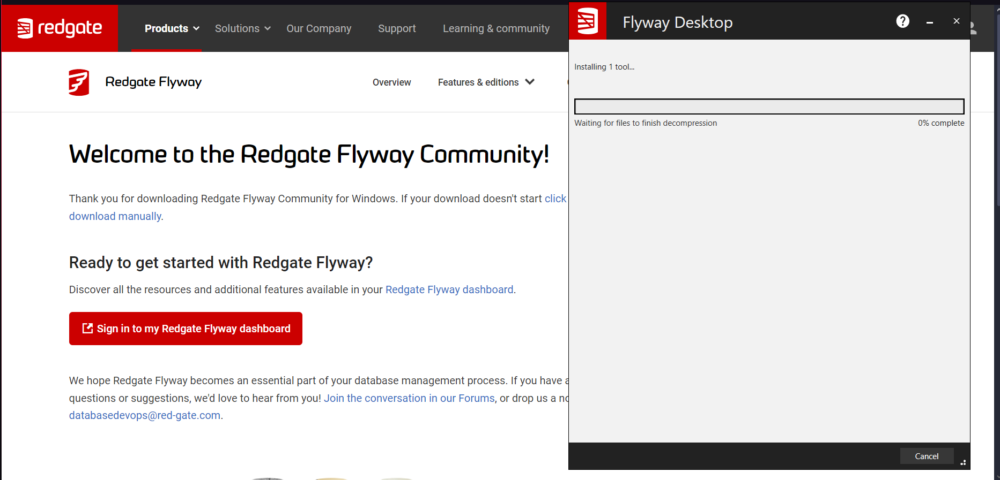
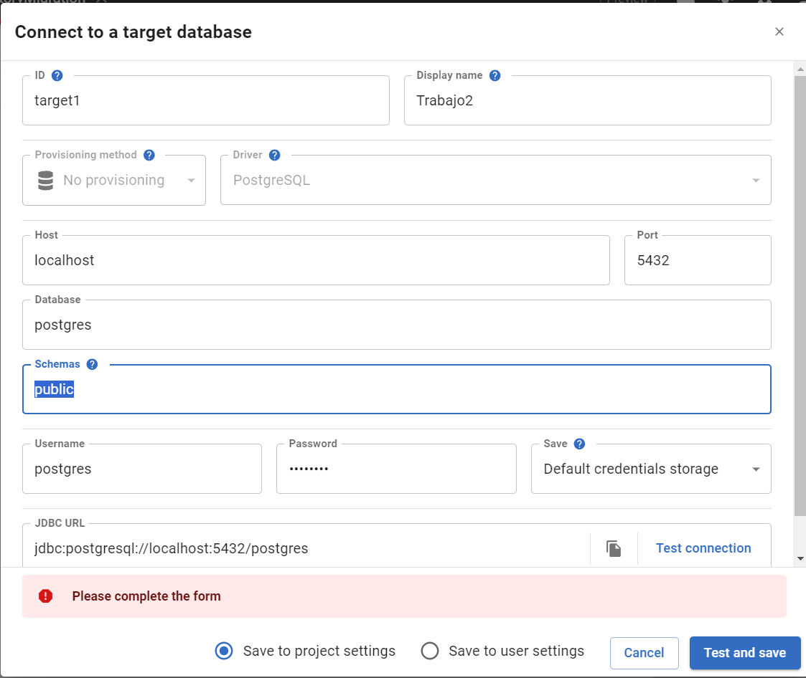
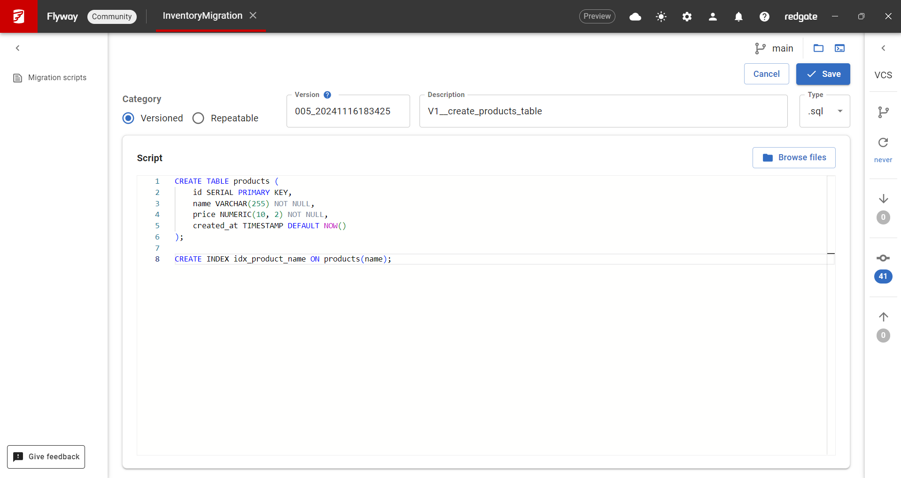
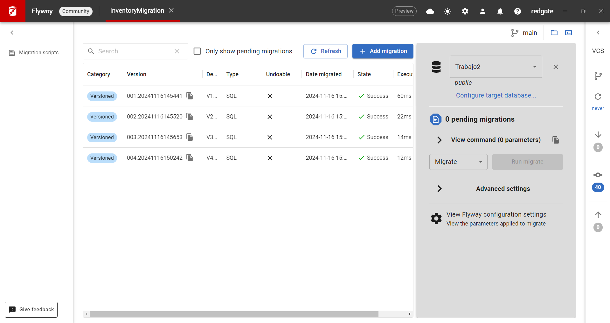
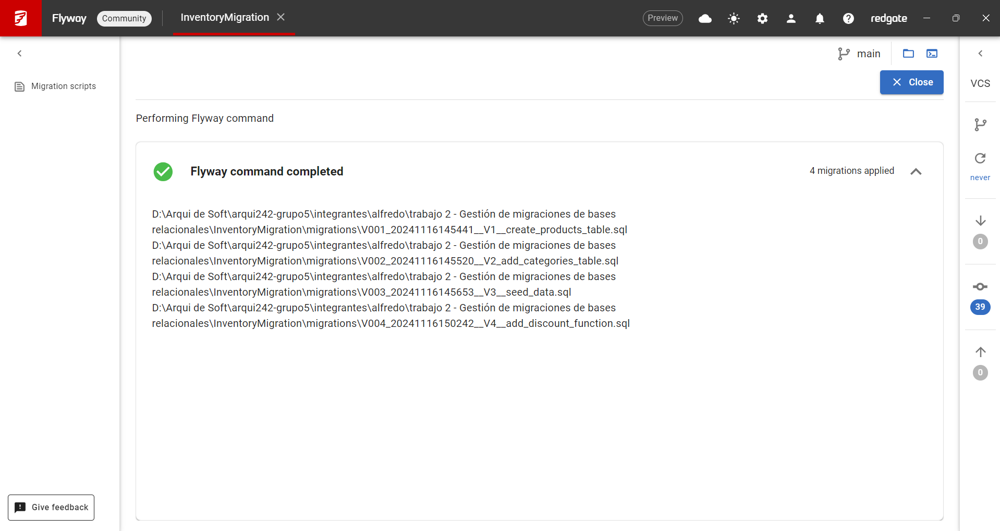
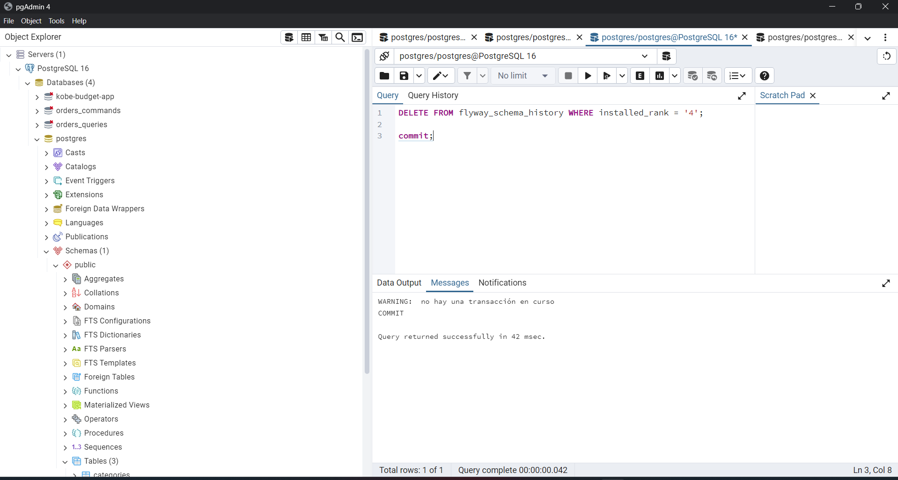

# Gestión de Migraciones en Bases de Datos Relacionales

## 1. Desarrollo Conceptual

### ¿Qué es la Gestión de Migraciones en Bases de Datos Relacionales?
La **gestión de migraciones en bases de datos relacionales** es el proceso estructurado y controlado de realizar cambios en el esquema de una base de datos. Este concepto asegura que cualquier alteración en la estructura de la base de datos (como la creación, modificación o eliminación de tablas, columnas o relaciones) se realice de forma reproducible, trazable y segura, sin afectar la integridad de los datos ni la continuidad operativa del sistema.

#### Contexto
En el desarrollo de software moderno, las bases de datos evolucionan a medida que cambian los requisitos de las aplicaciones. Por ejemplo:
- Se agregan nuevas funcionalidades que requieren nuevas tablas o columnas.
- Se eliminan tablas obsoletas para optimizar el sistema.
- Se ajustan restricciones para mejorar la calidad de los datos.

Sin una gestión adecuada, estos cambios pueden introducir inconsistencias, pérdida de datos o incluso interrupciones en la producción.

---

### Objetivos Principales de la Gestión de Migraciones
1. **Versionamiento del esquema**:
   - Permite mantener un historial claro de los cambios realizados en la base de datos.
   - Cada cambio tiene una versión única y secuencial.
   
2. **Reproducibilidad**:
   - Garantiza que los mismos cambios se apliquen de manera consistente en diferentes entornos (desarrollo, pruebas y producción).

3. **Control de riesgos**:
   - Minimiza los riesgos de errores al aplicar cambios.
   - Incluye mecanismos de reversión (rollback) para deshacer cambios en caso de fallos.

4. **Colaboración**:
   - Facilita que múltiples desarrolladores trabajen simultáneamente sin conflictos.

---

### Elementos Clave en la Gestión de Migraciones
1. **Esquema inicial**: Punto de partida que describe la estructura base de la base de datos.
2. **Scripts de migración**:
   - Archivos que describen los cambios a realizar (en SQL o en lenguaje soportado por herramientas específicas).
   - Ejemplo: `ALTER TABLE users ADD COLUMN email VARCHAR(255);`
3. **Herramientas de migración**:
   - Automatizan la ejecución y seguimiento de los scripts.
   - Ejemplos: Flyway, Liquibase, herramientas propias de los ORMs (como Sequelize en Node.js o Entity Framework en .NET).
4. **Ambientes**:
   - Desarrollo: Cambios iniciales y pruebas.
   - Staging: Validación de los cambios en un entorno similar a producción.
   - Producción: Aplicación final con el menor riesgo posible.
5. **Reversión**:
   - Mecanismo para revertir cambios en caso de errores.
   - Ejemplo: Un script para eliminar una columna si fue agregada erróneamente.

---

### Buenas Prácticas
1. **Cambios atómicos**:
   - Cada script de migración debe realizar un solo cambio lógico.
   - Esto facilita la depuración y la trazabilidad.

2. **Pruebas exhaustivas**:
   - Probar las migraciones en entornos de desarrollo y staging antes de ejecutarlas en producción.

3. **Respaldos regulares**:
   - Realizar respaldos de la base de datos antes de aplicar migraciones.

4. **Manejo de datos sensibles**:
   - Asegurar que los datos críticos sean protegidos durante las migraciones.

---

## 2. Consideraciones Técnicas: Implementación con Flyway

### ¿Por qué Flyway?
Flyway es una herramienta potente y ampliamente adoptada para la gestión de migraciones en bases de datos relacionales. Ofrece una solución estructurada para aplicar cambios al esquema de la base de datos mientras garantiza la consistencia y reproducibilidad de las modificaciones.

#### Características Principales:
1. **Versionamiento de Migraciones**:
   - Organiza los scripts en un orden secuencial utilizando un esquema de nombres específico (`V1__descripcion.sql`, `V2__descripcion.sql`).
2. **Reversión de Cambios**:
   - Permite revertir migraciones utilizando archivos `undo` para cada script aplicado.
3. **Validación del Estado**:
   - Verifica que los scripts aplicados coincidan con la configuración actual de la base de datos.
4. **Compatibilidad Multibase**:
   - Soporta múltiples sistemas de bases de datos como PostgreSQL, MySQL, Oracle, SQL Server, entre otros.
5. **Automatización e Integración**:
   - Se integra fácilmente en pipelines CI/CD, lo que permite automatizar la gestión de migraciones.

---

### Instalación y Configuración

#### 1. Descarga Flyway
1. Accede al sitio oficial de Flyway: [Flyway Downloads](https://flywaydb.org/download).
   
2. Descarga el paquete adecuado para tu sistema operativo.

---
## 3. Demo con Flyway Dekstop

Link de la demo: https://youtu.be/tInak6TpNTA

#### 1. Crear un Proyecto
1. Abre Flyway Desktop y selecciona New project....
2. Ingresa un nombre descriptivo para tu proyecto (por ejemplo, InventoryMigration).
3. Configura la conexión a tu base de datos introduciendo los siguientes datos:
   - **Host**: localhost (o la dirección de tu servidor de base de datos).
   - **Puerto**: 5432 (para PostgreSQL).
   - **Nombre de la base de datos**: Por ejemplo, inventory_db.
   - **Usuario**: El usuario configurado para la base de datos (por ejemplo, admin).
   - **Contraseña**: La contraseña asociada al usuario.
    

#### 2. Generar Migraciones

1. En la interfaz de Flyway Desktop, selecciona `Create new migration`.
2. Asigna un nombre descriptivo a la migración. Flyway generará un archivo con el formato adecuado, por ejemplo, `V1__create_products_table.sql`.
3. Abre el archivo generado y define los cambios necesarios en el esquema.

**Ejemplo del primer archivo de migración (`V1__create_products_table.sql`):**
```sql
CREATE TABLE products (
    id SERIAL PRIMARY KEY,
    name VARCHAR(255) NOT NULL,
    price NUMERIC(10, 2) NOT NULL,
    created_at TIMESTAMP DEFAULT NOW()
);

CREATE INDEX idx_product_name ON products(name);
```


**Descripción:**

- Este script crea la tabla products y un índice en la columna name para optimizar las búsquedas.
- Es un ejemplo de versionamiento inicial del esquema, uno de los principios clave en la gestión de migraciones.

#### 3. 2da migración: Agregar Tablas Relacionadas y Restricciones
El siguiente paso consiste en extender el esquema con nuevas tablas relacionadas. Añadiremos una tabla `categories` y estableceremos una relación con `products`.

Archivo de migración(`V2_add_categories_table.sql`):
```sql
CREATE TABLE categories (
    id SERIAL PRIMARY KEY,
    name VARCHAR(255) NOT NULL UNIQUE,
    created_at TIMESTAMP DEFAULT NOW()
);

ALTER TABLE products ADD COLUMN category_id INT;
ALTER TABLE products ADD CONSTRAINT fk_category
    FOREIGN KEY (category_id)
    REFERENCES categories (id)
    ON DELETE SET NULL;
```

**Descripción:**

- Se crea la tabla categories para clasificar los productos.
- Se añade una relación de clave foránea en la tabla products, asegurando la integridad referencial.
- Esto refleja cómo las migraciones permiten evolucionar el esquema de manera controlada.

#### 4. 3era Migración: Insertar Datos Iniciales (Seed Data)
Una migración típica incluye la carga de datos iniciales necesarios para que el sistema funcione correctamente. Esto se logra con un script de migración dedicado.

Archivo de migración (`V3__seed_data.sql`):

```sql
INSERT INTO categories (name) VALUES ('Electronics'), ('Clothing'), ('Groceries');
INSERT INTO products (name, price, category_id) VALUES
    ('Laptop', 1200.50, 1),
    ('T-Shirt', 15.00, 2),
    ('Apple', 0.50, 3);
```

**Descripción:**

- Este script inserta datos en las tablas categories y products.
- La carga inicial de datos es una práctica común en migraciones para configurar el sistema con información base.

#### 5. 4ta migración: Crear Funciones Almacenadas

Añadiremos una función almacenada que permite calcular descuentos en los precios de los productos.

Archivo de migración (`V4__add_discount_function.sql`):

```sql
CREATE OR REPLACE FUNCTION apply_discount(price NUMERIC, discount NUMERIC)
RETURNS NUMERIC AS $$
BEGIN
    RETURN price - (price * discount / 100);
END;
$$ LANGUAGE plpgsql;
```

**Aplicación de la migración:**

1. En Flyway Desktop, selecciona el script `V4__add_discount_function.sql`.
2. Haz clic en `Migrate` para ejecutar el script.

**Resultados esperados:**
- La base de datos ahora incluye una función que calcula descuentos.




#### 6. Validar el Estado de las Migraciones
Después de aplicar todas las migraciones, es crucial validar que el estado actual de la base de datos sea consistente con los scripts aplicados.

**Acción en Flyway Dekstop:**

1. Haz click en `Validate` para verificar la consistencia.

**Resultados esperados:**
- Flyway confirmará que todas las migraciones se han aplicado correctamente y que no hay discrepancias.

#### 7. Revertir cambios

En Flyway, la funcionalidad de `Undo` para revertir migraciones solo está disponible en las versiones premium (Flyway Teams o Flyway Enterprise). Sin embargo, en la versión gratuita, existen métodos alternativos para deshacer los cambios realizados por una migración. En este caso, utilizaremos el enfoque de eliminar el registro correspondiente de la tabla `flyway_schema_history`.

Este método es efectivo para volver a ejecutar una migración desde el principio o revertir cambios manualmente.

**Simulación de un error en producción y reversión manual:**

1. Identificar la migración a revertir:

- Supongamos que necesitamos deshacer la migración `V004__add_discount_function.sql`, la cual creó la función `apply_discount`.

2. **Revertir manualmente los cambios:**

- Ejecuta el siguiente comando SQL en tu base de datos para eliminar la función creada por esa migración:

```sql
DROP FUNCTION apply_discount;
```

3. **Eliminar el registro en `flyway_schema_history`:**
- Flyway almacena el estado de cada migración en la tabla `flyway_schema_history`. Para que Flyway considere la migración `V004` como pendiente nuevamente, elimina su registro:

```sql
DELETE FROM flyway_schema_history WHERE installed_rank = '4';
```


**Nota importante**: Asegúrate de eliminar únicamente el registro correspondiente a la versión que deseas deshacer.

**Resultados esperados:**

- La función `apply_discount` será eliminada de la base de datos manualmente.
- Flyway marcará la migración `V004` como pendiente después de eliminar el registro correspondiente en `flyway_schema_history`.
- La migración podrá ejecutarse nuevamente al hacer clic en `Migrate`.

**Nota:** Este enfoque requiere cuidado para evitar inconsistencias, pero es una solución viable en la versión gratuita de Flyway. En versiones premium, el comando `Undo` permite automatizar este proceso sin la necesidad de intervención manual.

---

## Resultados Finales
### Cambios Aplicados

- **Migración 1**: Agregamos la tabla categories y su relación con products.
- **Migración 2**: Insertamos datos iniciales en ambas tablas.
- **Migración 3**: Creamos una función almacenada para calcular descuentos.

### Validación
- Todas las migraciones fueron validadas exitosamente.

### Reversión

- La función almacenada fue eliminada correctamente al simular un error.

### Conclusión
Esta demo reflejó cómo gestionar cambios incrementales en un esquema existente utilizando Flyway. Cada migración representó un paso en la evolución del sistema, demostrando:

- **Versionamiento estructurado**: Cada cambio fue documentado y aplicado de manera secuencial.
- **Reproducibilidad**: Los scripts de migración se pueden aplicar de manera consistente en diferentes entornos.
- **Control de riesgos**: La validación y la reversión permitieron mantener la estabilidad de la base de datos.

Flyway es una herramienta clave para implementar prácticas de gestión de migraciones en bases de datos relacionales de forma eficiente y segura.

---
## Fuentes

1. **Documentación Oficial de Flyway**  
   - Sitio web: [https://flywaydb.org/documentation](https://flywaydb.org/documentation)  
   - Descripción: Fuente primaria para entender cómo funciona Flyway, sus comandos, y configuraciones.

2. **PostgreSQL JDBC Driver**  
   - Sitio web: [https://jdbc.postgresql.org/](https://jdbc.postgresql.org/)  
   - Descripción: Descarga de controladores JDBC necesarios para conectar Flyway con PostgreSQL.

3. **Redgate Blog sobre Flyway**  
   - Sitio web: [https://www.red-gate.com/blog](https://www.red-gate.com/blog)  
   - Descripción: Artículos técnicos y tutoriales relacionados con el uso avanzado de Flyway.

4. **Tutorial de Flyway para Gestión de Migraciones**  
   - Sitio web: [https://www.baeldung.com/database-migrations-with-flyway](https://www.baeldung.com/database-migrations-with-flyway)  
   - Descripción: Una guía práctica para empezar con Flyway, escrita por Baeldung.

5. **Documentación de PostgreSQL**  
   - Sitio web: [https://www.postgresql.org/docs/](https://www.postgresql.org/docs/)  
   - Descripción: Referencia completa para trabajar con PostgreSQL, útil para entender las operaciones realizadas en los scripts de migración.

6. **Artículo sobre Gestión de Migraciones de Bases de Datos**  
   - Sitio web: [https://martinfowler.com/articles/evodb.html](https://martinfowler.com/articles/evodb.html)  
   - Descripción: Explicación conceptual sobre la evolución de esquemas de bases de datos y la importancia de las migraciones.

7. **GitHub Repository de Ejemplos de Flyway**  
   - Sitio web: [https://github.com/flyway/flyway-example](https://github.com/flyway/flyway-example)  
   - Descripción: Repositorio oficial con ejemplos de configuración y uso de Flyway en diferentes escenarios.

8. **Stack Overflow - Preguntas sobre Flyway**  
   - Sitio web: [https://stackoverflow.com/questions/tagged/flyway](https://stackoverflow.com/questions/tagged/flyway)  
   - Descripción: Comunidad donde puedes encontrar soluciones a problemas comunes y preguntas frecuentes sobre Flyway.

