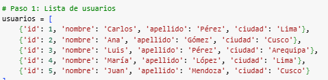
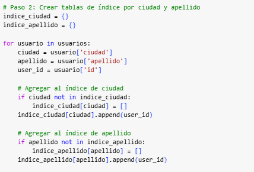
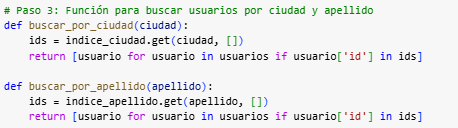
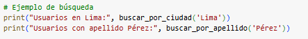
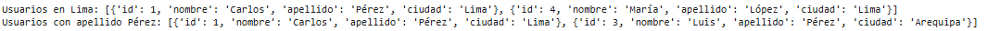

# Trabajo: Implementación de Patrones Cloud

# Patron: Index Table

## Instrucciones Generales

1. **Elección de Tema**: Index Table

   - Seleccione uno de los patrones de cloud del catálogo de Microsoft: [Microsoft Cloud Patterns](https://learn.microsoft.com/en-us/azure/architecture/patterns/).
   - Asegúrese de registrar su elección en el listado de grupos publicado en Blackboard para evitar duplicaciones de temas.

2. **Desarrollo del Patrón**:
   
   - **Problema**: En muchos almacenes de datos, la información se organiza usando una clave primaria, lo que permite localizar datos de manera eficiente. Sin embargo, cuando se necesita realizar una consulta por un campo diferente (por ejemplo, "ciudad" en lugar de "ID de cliente"), la búsqueda se vuelve lenta, ya que no hay un índice para ese campo.
   - **Solución**: El patrón propone crear manualmente tablas de índice organizadas por las claves secundarias necesarias para las consultas. Existen tres estrategias comunes:
      -  Desnormalización completa: Duplicar los datos en cada tabla de índice, organizados por claves diferentes (por ejemplo, ciudad, apellido). Esto mejora el rendimiento de las consultas, pero aumenta el espacio de almacenamiento y la complejidad de mantenimiento cuando los datos cambian frecuentemente.
      - Tablas de índice normalizadas: En lugar de duplicar los datos, las tablas de índice contienen referencias a los datos originales utilizando la clave primaria (tabla de hechos). Esto reduce el almacenamiento, pero implica dos búsquedas: primero en la tabla de índice y luego en la tabla de hechos.
      - Desnormalización parcial: Se duplican solo los campos más consultados en las tablas de índice, mientras que otros datos se mantienen en la tabla de hechos. Esto balancea el rendimiento y el espacio de almacenamiento, reduciendo la carga de mantenimiento.
   - **Casos de Aplicación**: Este patrón es útil cuando se trabaja con grandes volúmenes de datos y consultas frecuentes por campos no primarios, especialmente en aplicaciones de análisis de datos, sistemas distribuidos o bases de datos NoSQL como DynamoDB, que no tienen soporte para índices secundarios nativos.
   Por ejemplo, en sistemas de comercio electrónico, donde las consultas pueden buscar por categorías, ciudades o rangos de precios, las tablas de índice permiten localizar productos o usuarios sin tener que recorrer toda la base de datos.
   - **Aplicación en su Trabajo de Grupo**: En Turi, el patrón Cloud **Index Table** puede ser utilizado para mejorar significativamente el rendimiento en la búsqueda y recuperación de información en módulos que manejan grandes cantidades de datos, como el módulo de reviews y el blog de destinos turísticos. A medida que los usuarios suben reseñas y comentarios, y otros consultan esta información, las consultas sobre los datos pueden volverse lentas, especialmente si se basan en atributos no primarios, como calificación, fecha de publicación, o tipo de lugar. El patrón Index Table permite crear tablas de índice especializadas que contienen sólo las claves necesarias para acceder a los registros de la tabla principal, organizadas según estos atributos específicos.
   Por ejemplo, se puede crear una tabla de índice que contenga las calificaciones de las reseñas junto con su ID correspondiente, lo que permite que las consultas de los usuarios que buscan los lugares mejor valorados se ejecuten mucho más rápido al no tener que recorrer toda la tabla de reviews. Del mismo modo, otra tabla de índice podría almacenar los registros ordenados por fecha, facilitando la búsqueda de las reseñas más recientes.
   Este patrón también garantiza que la plataforma sea más escalable, ya que al aumentar el volumen de datos, las búsquedas seguirán siendo eficientes sin comprometer el tiempo de respuesta. 
3. **Desarrollo de Código y Demo**:

   Para el desarrollo de la demo, se utilizo Google Collab como entorno de desarollo y Python como lenguaje.

   **Paso 1: Creación de Datos (Lista de Usuarios)**

   Se crea una lista de datos que represente a los usuarios de la plataforma Turi. Este conjunto de datos contara para esta demo con los siguientes datos por usuario: un ID, nombre, apellido y ciudad. Cada elemento de usuarios es un diccionario que representa un usuario con un id único. Se usa el id como clave primaria y los demas son atributos adicionales como nombre, apellido y ciudad, los cuales serán útiles para hacer búsquedas.

   

   **Paso 2: Creación de Tablas de Índice (Por Ciudad y Apellido)**

   Se crean índices secundarios que permitan realizar búsquedas eficientes por ciudad y apellido. Se utilizan dos diccionarios, indice_ciudad e indice_apellido, donde se almacenarán listas de IDs de los usuarios asociados a cada ciudad o apellido.

   - Agregar al indice de ciudad: Si la ciudad no está en indice_ciudad, se crea una nueva lista vacía para esa ciudad y se añade el user_id de cada usuario que viva en esa ciudad.
   - Agregar al indice de apellido: Si el apellido no está en el indice_apellido, se crea una nueva lista vacia para ese apellido y se añade el user_id de cada usuario que tenga ese apellido.
   
   Al finalizar este paso, los diccionarios indice_ciudad e indice_apellido permiten acceder rápidamente a los usuarios por su ciudad o apellido sin tener que recorrer toda la lista de usuarios.

   

   **Paso 3: Funciones de Búsqueda (Usando el Índice)**

   Para realizar búsquedas de usuarios por ciudad o apellido, se crean funciones que consultan las tablas de índice creadas en el paso anterior.

   - buscar_por_ciudad(ciudad): Esta función toma como parametro una ciudad. Luego, utiliza el índice indice_ciudad para recuperar la lista de IDs correspondientes a esa ciudad y, finalmente busca en la lista usuarios para obtener los usuarios completos.

   - buscar_por_apellido(apellido): Hace lo mismo, pero para el apellido. Consulta indice_apellido, recupera los IDs y encuentra los usuarios.

   

   Finalmente, se realiza un ejemplo de busqueda donde se mostrarán todos los usuarios que viven en Lima y todos los que tienen el apellido Pérez. Al usar las tablas de índice, se obtienen los datos de manera eficiente, sin necesidad de recorrer toda la lista cada vez.

   

   

