# Data Engineering

# ¿Que es?

La Ingeniería de Datos (Data Engineering) es una disciplina clave dentro del mundo de los datos y la analítica. Se refiere a la creación de sistemas y arquitecturas que permiten capturar, almacenar, procesar y transformar datos para que sean utilizados en análisis, modelos de machine learning y aplicaciones empresariales.

# ¿Cual es la tarea de un Ingeniero de Datos?

Los ingenieros de datos son responsables de desarrollar las infraestructuras que gestionan el flujo de datos dentro de una organización. Esto incluye el diseño de pipelines de datos (flujos de trabajo automatizados que extraen, transforman y cargan datos, conocidos como ETL o ELT), la construcción de almacenes de datos (Data Warehouses) y la optimización de la eficiencia del procesamiento de datos a gran escala.

# Componentes Clave

### a) Representación y manipulación de datos
Se refiere a la estructura y organización de los datos para facilitar su uso y análisis. Esto incluye:

- Modelado de datos: Definir cómo los datos se organizan. Puede ser en esquemas relacionales o no relacionales.
- Almacenamiento: Puede ser en esquemas relacionales (SQL) o no relacionales (NoSQL).

### b) Arquitecturas de datos: 
Son el diseño de sistemas escalables y robustos para gestionar grandes volúmenes de datos. Algunas de las arquitecturas más comunes son:

- Sistemas distribuidos: Como Hadoop o Spark, que permiten procesar grandes volúmenes de datos distribuidos en varios servidores.
- Data Lakes: Un repositorio centralizado para almacenar datos estructurados y no estructurados en su formato nativo.
### c) Pipelines de datos (ETL/ELT)
Los pipelines de datos son flujos de trabajo que automatizan la extracción, transformación y carga de datos:

- ETL (Extract, Transform, Load): Los datos se extraen de varias fuentes, se transforman para cumplir con ciertos criterios, y se cargan en un destino (como un Data Warehouse).
- ELT (Extract, Load, Transform): Los datos se cargan sin transformar y las operaciones de transformación se realizan después.

### d) Gestión de datos
Implica garantizar que los datos sean accesibles, limpios y consistentes. Este proceso incluye:

- Calidad de datos: Eliminar duplicados, corregir errores, gestionar datos ausentes.
- Gobernanza de datos: Normativas y políticas para garantizar la seguridad y cumplimiento de los datos.

# Herramientas Populares

- Apache Hadoop: Framework para almacenamiento y procesamiento de grandes conjuntos de datos de manera distribuida. Hadoop permite dividir los datos en bloques que se distribuyen en múltiples nodos dentro de un clúster, lo que permite un procesamiento paralelo eficiente.
- **Apache Spark**: Framework para procesamiento de datos en memoria que permite procesar grandes volúmenes de datos a alta velocidad. **Sera el utilizado para la demo**.
- Kafka: Sistema de mensajería distribuida para gestionar flujos de datos en tiempo real.
- SQL: Lenguaje estándar para manejar bases de datos relacionales.
- NoSQL (MongoDB, Cassandra): Bases de datos no relacionales para almacenar grandes volúmenes de datos no estructurados.
- Plataformas en la nube (AWS, Google Cloud, Azure): Ofrecen servicios gestionados para almacenar, procesar y analizar datos sin tener que gestionar la infraestructura física.

# Ventajas
- Procesamiento de grandes volúmenes de datos: Permite a las organizaciones manejar petabytes de datos sin perder eficiencia.
- Automatización: La creación de pipelines automatizados facilita la entrega constante de datos limpios y listos para el análisis.
- Escalabilidad: Los sistemas de ingeniería de datos pueden expandirse para manejar un mayor volumen de datos sin necesidad de rediseñar la arquitectura.
- Optimización del rendimiento: Los sistemas bien diseñados mejoran el rendimiento de análisis de datos y consultas en tiempo real.

# Desventajas

- Complejidad técnica: La configuración y mantenimiento de sistemas de datos distribuidos y escalables requiere un alto nivel de conocimiento técnico.
- Costos: Las soluciones de datos, especialmente en la nube, pueden ser costosas dependiendo del tamaño y uso de los datos.
- Riesgos de seguridad: Manejar grandes volúmenes de datos implica también mayores riesgos en cuanto a privacidad y cumplimiento normativo.

# Campos de aplicacion

El Data Engineering es utilizado en una variedad de campos:

- Ciencia de datos: Proporciona los datos necesarios para análisis predictivos, machine learning y estadísticas avanzadas.
- Business Intelligence (BI): Los ingenieros de datos preparan y estructuran los datos para visualización y análisis empresarial.
- IoT (Internet de las cosas): Facilita el procesamiento de grandes volúmenes de datos generados por dispositivos conectados.

## Apache Spark

Apache Spark es una plataforma de computación distribuida de código abierto diseñada para procesar grandes volúmenes de datos a gran velocidad.
Fue desarrollado en el laboratorio AMPLab de la Universidad de California, Berkeley. Spark se ha convertido en una herramienta esencial debido a su velocidad, facilidad de uso y capacidad para manejar una variedad de tareas de procesamiento de datos, lo cual lo hace destacar al ser más rápido que otros frameworks.

### Componentes de Spark

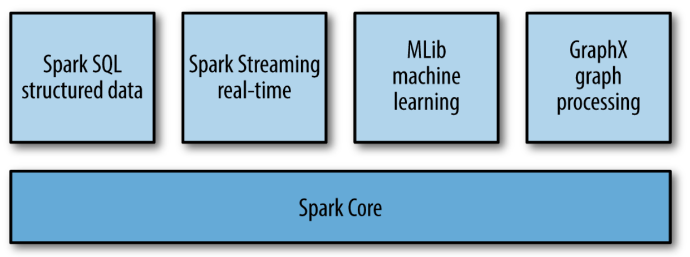

- Spark Core:
Este es el motor central y proporciona las funcionalidades básicas para la distribución y paralelización de tareas a través de varios nodos en un clúster.
- Spark SQL:
Permite trabajar con datos estructurados y semiestructurados usando una API SQL y DataFrames. Spark SQL es muy popular porque permite ejecutar consultas SQL estándar sobre los datos, así como trabajar con tablas y bases de datos relacionales.
- Spark Streaming:
Permite el procesamiento en tiempo real de flujos de datos continuos desde fuentes como Kafka y los procesa en tiempo real.
- MLlib (Machine Learning Library):
Es la biblioteca de Machine Learning de Apache Spark. Proporciona herramientas para el aprendizaje automático escalable, con soporte para tareas como clasificación, regresión, clustering y filtrado colaborativo.
- GraphX:
Permite el procesamiento, análisis de grafos, realizar consultas y ejecutar algoritmos de análisis.

## Demo

La demostración se centrará en el componente Spark SQL, que permite realizar consultas SQL sobre datos estructurados en un entorno distribuido. En este caso, el escenario que se utilizará es un conjunto de datos de ventas de productos en una pagina web. Para la demo, usaremos como entorno Collaborate de Google para probar el codigo.

Link de video: https://youtu.be/JDanFp5gJ0o
1) Instalación de PySpark: Instalaremos la librería pyspark, la cual es necesaria para utilizar Apache Spark.
   
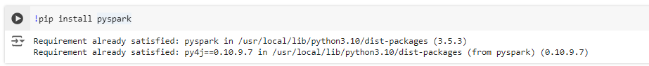

2) Se importan las clases necesarias:

- SparkSession: entrada principal para crear un contexto de Spark.
- col y when: funciones utilizadas para manipular columnas en DataFrames.

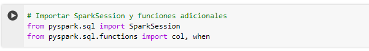

3) Se crea una nueva SparkSession, la cual es el punto de entrada principal para trabajar con Apache Spark y es necesaria para realizar operaciones en Spark, como leer y escribir datos en distintos formatos, ejecutar consultas SQL, manipular DataFrames, etc. La función "builder" inicia el proceso de creación de la sesión, y con "appName("Ventas Demo")" se asigna un nombre a la aplicación, lo que facilita su identificación en el entorno de Spark. La funcion "getOrCreate()" se asegura de que si no existe ya una sesión activa, se cree una nueva.

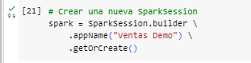

4) Se cargan los datos desde un archivo CSV llamado *ventas_db_demo.csv*, donde la primera línea del archivo CSV contiene los encabezados y configura en el parametro header= True. Luego, se visualizan los datos cargados usando show().

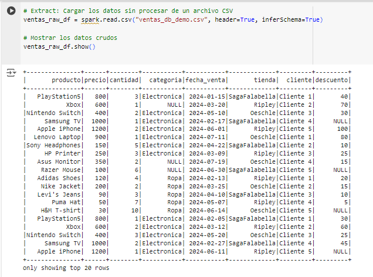

5) Se realiza la limpieza y transformación de los datos, rellenando valores nulos en las columnas precio y descuento con el numero 0 y en la columna categoria con "Desconocido". Los precios y descuentos se convierten a la moneda soles, ya que la base esta en dolares.
   
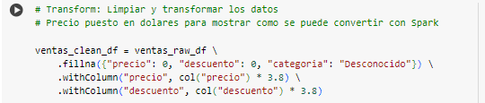

6) Se crea una nueva columna "total_compra", para calcular el valor total de la compra del cliente (precio por cantidad, menos el descuento) y se muestran los datos luego de esta limpieza y transformación.
   
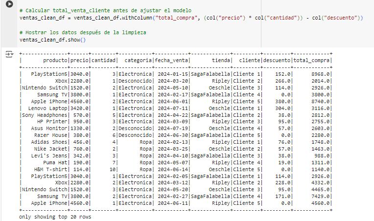

7) Se crea una vista temporal llamada "ventas_limpias", lo que permite ejecutar consultas SQL sobre los datos.

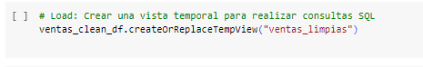

8) Se realiza algunos ejemplos de consultas en SQL para mostrar como Spark puede convertir un archivo csv en un formato de base de datos SQL para realizar consultas con el.

- Ejemplo 1: obtener el total de ventas por producto sin aplicar descuento, sumando el precio multiplicado por la cantidad. Luego se ordena en orden descendente.

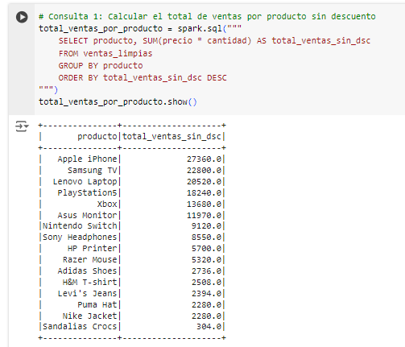

- Ejemplo 2: Se obtiene la cantidad total vendida de cada producto y se ordena en orden descendente.
  
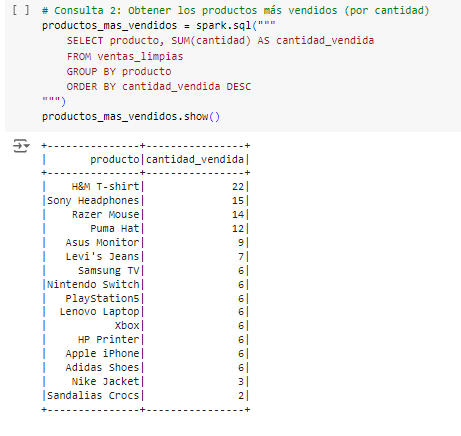

- Ejemplo 3: Se calcula el total de ventas por tienda, sumando el precio multiplicado por la cantidad vendida.
  
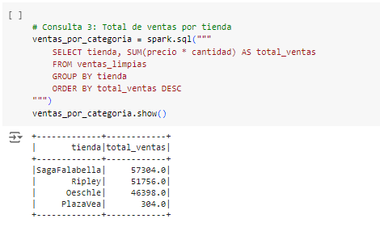

- Ejemplo 4: Se calcula el total de consumo
-  por cliente y se ordena por el monto gastado por cada cliente.
  
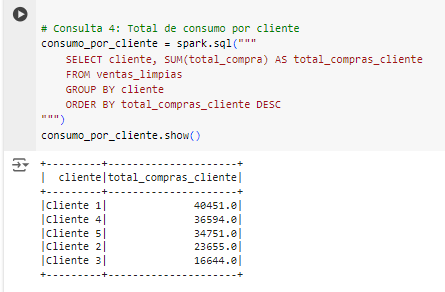

9) Los datos limpios y procesados se almacenan en formato Parquet, que es óptimo para el almacenamiento y procesamiento de grandes volúmenes de datos. Luego, se carga y muestra el esquema de los datos guardados en formato Parquet. Finalmente, se generan estadísticas descriptivas sobre los datos procesados (como el promedio, mínimo, máximo, etc.).

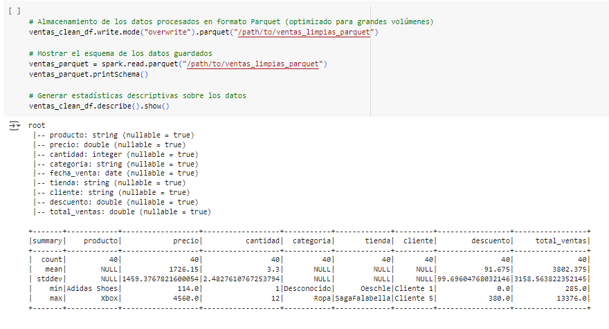