# Seguridad en Contenedores

# ¿Que es?

La Seguridad en Contenedores es una disciplina dentro de la seguridad informática enfocada en proteger los entornos de contenedores, como Docker y Kubernetes. Este tipo de tecnología permite empaquetar aplicaciones y sus dependencias en un entorno aislado, lo que facilita su despliegue y escalabilidad. Sin embargo, al estar en constante uso y distribución, también presenta vulnerabilidades específicas que requieren prácticas de seguridad dedicadas.

# Componentes Clave

### a) Imágenes de Contenedores Seguras
- Contenedor:
Los contenedores son instancias de ejecución basadas en imágenes.
 - Imagen:
 Una imagen de contenedor es como un snapshot de un sistema 
 operativo o aplicación que contiene todo lo necesario para 
 ejecutar un servicio.
Las imágenes de contenedores deben estar libres de vulnerabilidades
 y contener solo los elementos esenciales.

Relacionandolo con el tema y la futura demo, **Escaneo de la Imagen = Aseguramiento del Contenedor**.
 El escaneo de la imagen es una manera de asegurar que los contenedores que se ejecuten desde esa imagen no tengan vulnerabilidades críticas que puedan poner en riesgo la infraestructura. Si la imagen está segura, entonces el contenedor que se ejecuta desde ella también lo estará, reduciendo el riesgo en el ambiente productivo.
- Escaneo de vulnerabilidades: Uso de herramientas que detectan vulnerabilidades conocidas en imágenes.

### b) Gestión de Red en Contenedores: 
Los entornos de contenedores requieren configuraciones específicas de red para evitar accesos no autorizados. Esto implica:

- Políticas de red: Definir reglas de tráfico y segmentación entre contenedores.
- Firewalls: Implementar firewalls para controlar el tráfico entre contenedores y con el exterior.

### c) Gestión de Identidades y Accesos
Es fundamental controlar quién tiene acceso a los contenedores y los permisos que poseen:

- Roles y permisos: Aplicar principios de mínima autoridad y control de acceso basado en roles (RBAC) en plataformas como Kubernetes.
- Autenticación y autorización: Asegurar que solo usuarios y servicios autenticados puedan interactuar con los contenedores.

### d) Monitorización y Registro
La monitorización constante permite detectar actividades sospechosas y responder a incidentes rápidamente:

- Logs de actividad: Mantener registros detallados de todas las operaciones en los contenedores.
- Monitorización en tiempo real: Herramientas que detectan cambios inesperados en los contenedores.

# Herramientas Populares

- ***Docker Desktop***: Una herramienta que proporciona un entorno local para desarrollar, probar y ejecutar contenedores Docker. Facilita la creación y gestión de contenedores en sistemas operativos Windows y macOS.
- Aqua Security: Proporciona seguridad en todo el ciclo de vida de los contenedores, desde el desarrollo hasta la ejecución.
- Kubernetes Security Context: Permite configurar permisos y restricciones para los contenedores dentro de Kubernetes.
- Falco: Un motor de detección de amenazas para contenedores que permite monitorizar actividades sospechosas en tiempo real.
- SELinux/AppArmor: Herramientas de seguridad para aplicar restricciones de ejecución en los contenedores.

# Ventajas
- Aislamiento de Aplicaciones: Los contenedores ofrecen una separación entre aplicaciones, lo que limita el impacto de una posible vulnerabilidad.
- Escalabilidad Segura: Permite desplegar aplicaciones a gran escala con políticas de seguridad replicables.
- Rapidez en la Implementación de Parcheos: Las imágenes de contenedores pueden actualizarse rápidamente, minimizando el tiempo de exposición a vulnerabilidades.

# Desventajas
- Complejidad de Gestión: La administración de políticas de seguridad en entornos de múltiples contenedores puede ser compleja y requerir un alto nivel de conocimiento.
- Superficie de Ataque Ampliada: Cada contenedor, imagen, y servicio asociado puede ser un posible punto de entrada para ataques.
- Riesgo de Configuraciones Incorrectas: Configuraciones inseguras pueden exponer contenedores a ataques externos.

# Campos de aplicacion

La seguridad en contenedores es fundamental en áreas como:

- Desarrollo de Software: Proteger el entorno de desarrollo y asegurar el despliegue seguro de aplicaciones.
- Fintech: Garantizar la seguridad en transacciones y operaciones en tiempo real utilizando contenedores.
- Telecomunicaciones: Implementar servicios de red en contenedores de manera segura y escalable.

## Demo

La demostración se centrará en el analisis de una una imagen de Nginx basada en Debian, la cual es una imagen de contenedor 
que contiene el servidor web Nginx, y cuya base es el sistema operativo Debian.

Algunos conceptos previos:
- Nginx: Es un servidor web de alto rendimiento y de código abierto, utilizado principalmente para servir aplicaciones web, actuar como balanceador de carga o como proxy inverso.
En esta imagen, Nginx es el servicio que se ejecutará dentro del contenedor para manejar las solicitudes HTTP y servir contenido web.

- Debian: es una distribución de Linux muy popular, conocida por su estabilidad y seguridad.
Esto significa que la imagen del contenedor está configurada para ejecutar Nginx sobre una instalación mínima de Debian. 

Link de video: https://www.youtube.com/watch?v=qyOVkTVxe8o

1) Instalación de Docker Desktop: Para la demo, instalaremos Docker Desktop, el cual es el entorno donde se manejan los contenedores, imagenes y otros conceptos.
    Para esto, lo instalaremos desde la pagina oficial de Docker: https://www.docker.com/get-started/
   
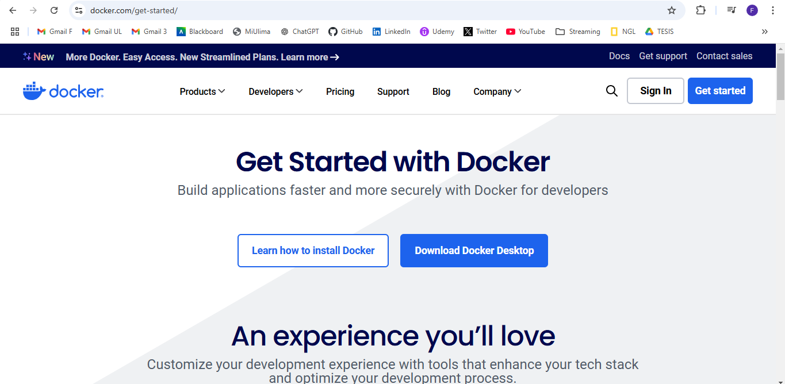

2)  Escogemos el instalador dependiendo del sistema operativo (en mi caso Windows AMD, ya que no es para un equipo movil).

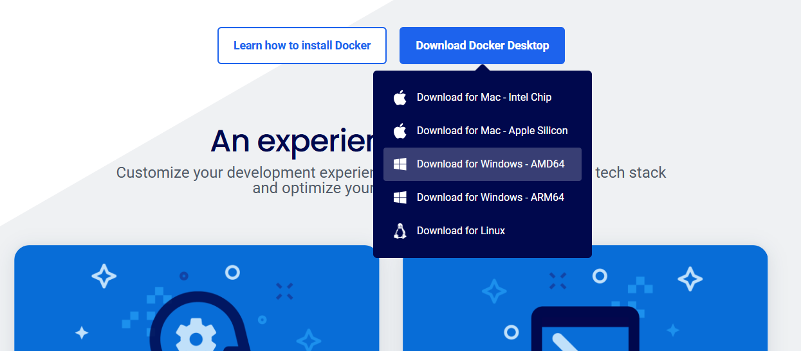

3) Una vez instalado, procedemos con aceptar todos los permisos y abrimos el programa.

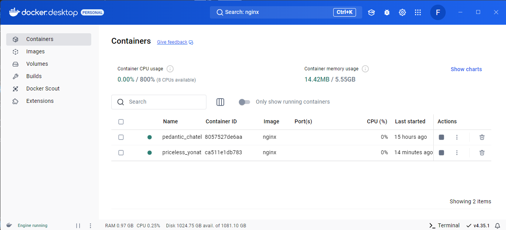

4) Para esto demo tambien necesitaremos utilizar el CMD para ejecutar comandos.
    El primer comando que ejecutaremos sera "docker ps", el cual nos permite ver todos los contenedores actuales.

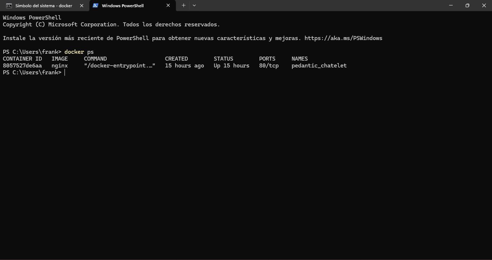

5) Como docker permite encontrar vulnerabilidades de imágenes, vamos crear una imagen de prueba ejecutando el comando: "ejemplo:docker pull nginx:latest"

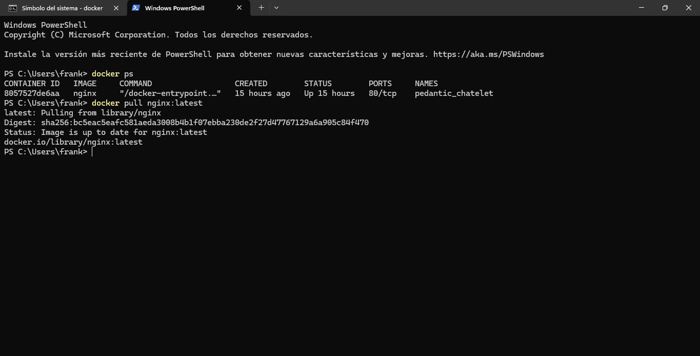

6) Nos dirigimos al apartado "Imagenes" en Docker Desktop para ver que se halla guardado la imagen al ejecutar el comando anterior.
El crear la imagen tambien crea un contenedor.
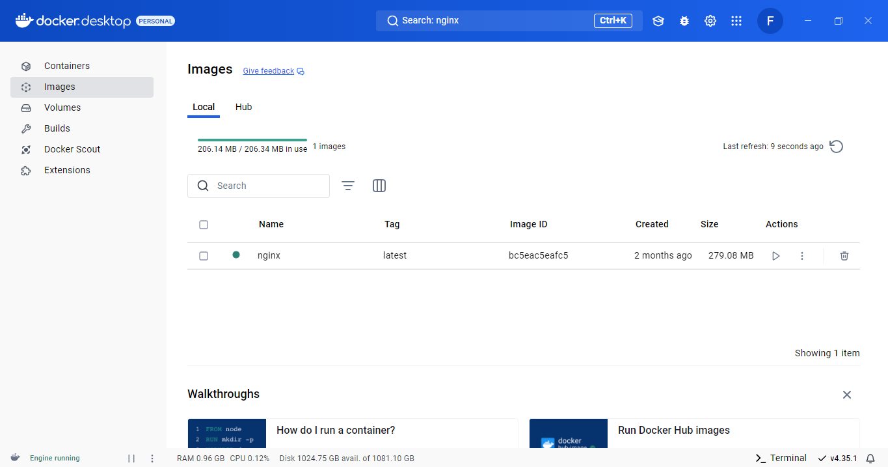

7) Para poder escanear la imagen vamos a instalar "Chocolatey", el cual es un gestor de paquetes para sistemas 
operativos Windows que permite instalar herramientas como Trivy (para el analisis de vulnerabilidades y escaneo de imagenes de Docker).
Para esto, buscamos "PowerShell" en la barra de tareas y le damos click para ejecutarlo como administrador, 
ya que es necesario los permisos para la instalacion.

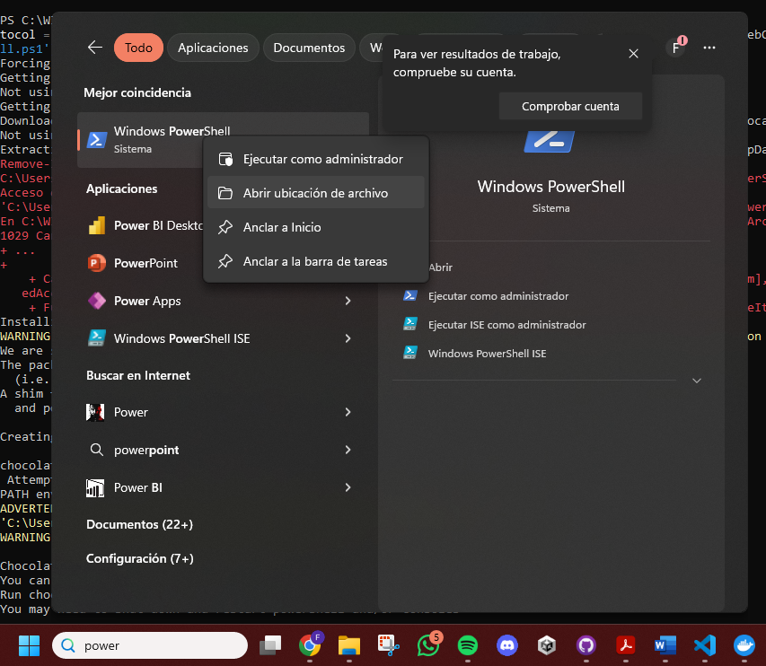

8) Luego, en el "PowerShell" ejecutamos el siguiente comando para instalacion de chocolatey:

$env:ChocolateyInstall = "$env:UserProfile\Chocolatey"
[System.Net.ServicePointManager]::SecurityProtocol = [System.Net.ServicePointManager]::SecurityProtocol -bor 3072
iex ((New-Object System.Net.WebClient).DownloadString('https://community.chocolatey.org/install.ps1'))

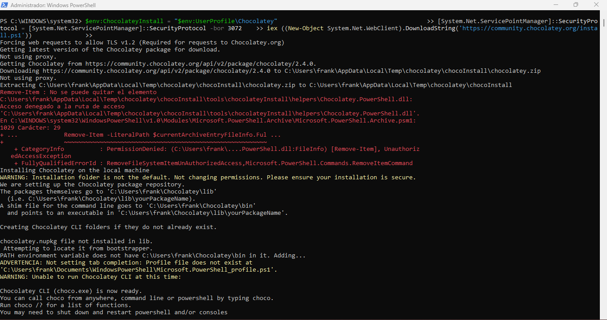

9) Luego, verificamos la version de chocolatey con "choco version--" e instalamos trivy usando el comando "choco install trivy"

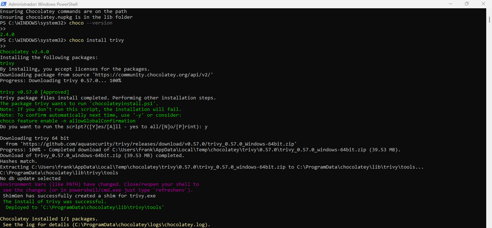

10) Corremos el comando " docker run --rm -v /var/run/docker.sock:/var/run/docker.sock aquasec/trivy image nginx:latest" para poder escanear la imagen y
    encontrar sus vulnerabilidades. Esto demora aproximadamente 10 minutos como maximo.

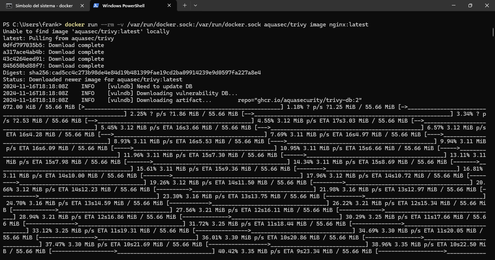

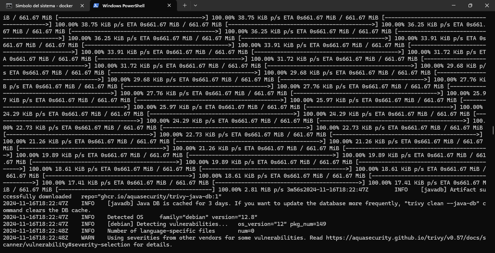

11) Una vez terminado el escaneo, dara una tabla a manera de informe con todas las vulnerabilidades:
    Para esta demo, se encontraron un total de 144 vulnerabilidades detectadas.
    Fueron clasificadas como:
    CRITICAL: 2
    HIGH: 16
    MEDIUM: 28
    LOW: 98
    UNKNOWN: 0 (sin clasificar).

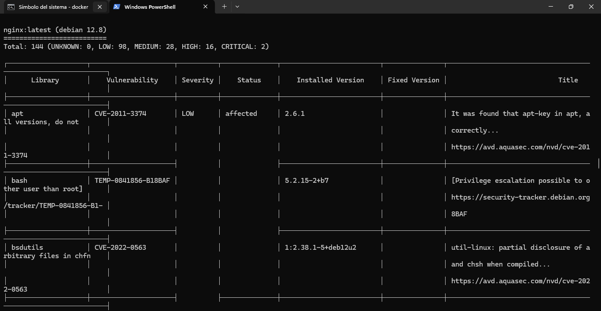
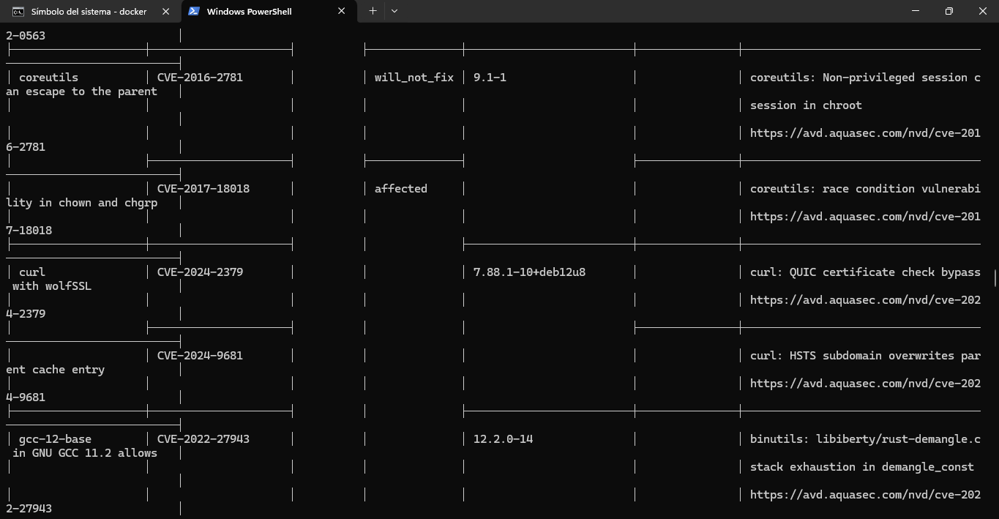

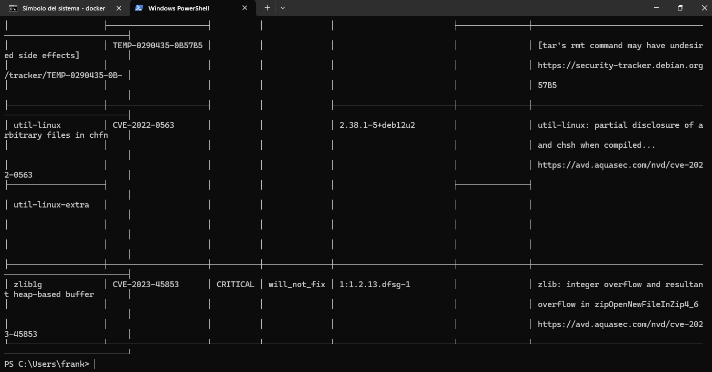

12) Para solucionar las vulnerabilidades de seguridad, una buena practica es actualizar a la ultima version (en este caso de Nginx) con el comando:
"docker run --rm -it nginx:latest bash -c "apt-get update; apt-get upgrade -y" Este comando actualizará todos los paquetes dentro del contenedor Docker basado en la imagen de nginx:latest. 
Si hay vulnerabilidades relacionadas con los paquetes, se corregirán tras la actualización.

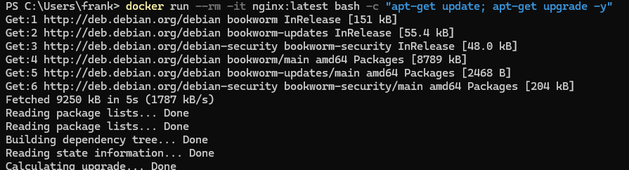

Conclusion:
El escaneo de la imagen de contenedor es una parte fundamental del aseguramiento de contenedores. 
Esta acción está directamente relacionada con el tema de **Seguridad en Contenedores**, ya que ayuda a identificar vulnerabilidades 
dentro de las imágenes que se utilizarán para ejecutar contenedores en un entorno productivo. 
Detectar y corregir estas vulnerabilidades antes de desplegar las imágenes asegura que los contenedores que corren en producción 
estén protegidos contra posibles ataques.

