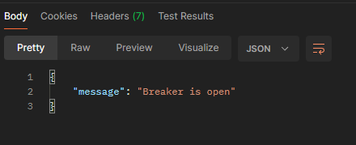
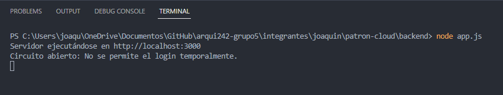
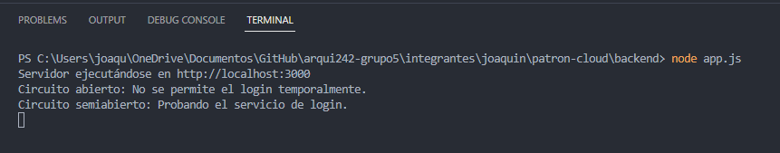
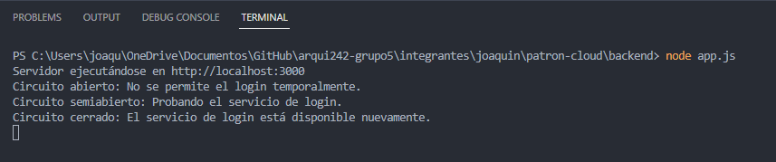

# CIRCUIT BREAKER

## 1. Problema

En una arquitectura de microservicios, donde múltiples servicios interactúan constantemente, la dependencia entre ellos puede ser un riesgo. Si un servicio falla o experimenta alta latencia, las solicitudes entrantes pueden quedar en espera o colapsar el sistema al no recibir una respuesta a tiempo. Sin un mecanismo de protección, estos fallos pueden propagarse, ocasionando que otros servicios se vean afectados, lo cual deteriora la experiencia de usuario y disminuye la disponibilidad del sistema. La falta de un manejo adecuado ante estos fallos genera que el sistema se vuelva frágil y vulnerable a caídas en cascada cuando un servicio está sobrecargado o no disponible.

## 2. Solución

El patrón **Circuit Breaker** propone una solución basada en el concepto de circuitos eléctricos: cuando detecta fallos repetidos en un servicio, interrumpe temporalmente las solicitudes hacia ese servicio, evitando que otros servicios se vean afectados por estos errores.

El Circuit Breaker tiene tres estados:
1. **Cerrado:** Permite el paso de todas las solicitudes. Si detecta un número de fallos consecutivos que exceden un umbral definido, el circuito cambia a un estado de "abierto".
2. **Abierto:** Bloquea las solicitudes al servicio fallido durante un tiempo, reduciendo el riesgo de sobrecarga. Durante este periodo, los clientes pueden recibir un mensaje de error o una respuesta predeterminada.
3. **Semi abierto:** Tras un tiempo de espera, el circuito se coloca en este estado y permite algunas solicitudes para verificar si el servicio está disponible nuevamente. Si estas solicitudes tienen éxito, el circuito vuelve a "cerrado". Si fallan, el estado cambia nuevamente a "abierto".

Al implementar Circuit Breaker, se reduce la sobrecarga en los servicios cuando están bajo presión, y se mitiga el riesgo de una cascada de errores que afecte otros microservicios. Este patrón asegura una experiencia más estable para los usuarios y permite que el sistema se recupere sin interrumpir su funcionamiento general.

> Herramientas como **Hystrix** (anteriormente de Netflix), **Resilience4j** y bibliotecas de implementación en servicios cloud (AWS, Azure) ofrecen capacidades de Circuit Breaker para manejar la resiliencia en microservicios.

## 3. Casos de Aplicación

**a. Plataforma de Streaming:** Si un servicio de recomendaciones o de procesamiento de datos para el usuario experimenta fallos, el Circuit Breaker previene que el servicio de streaming se vea afectado. Así, la reproducción de contenido sigue operativa mientras el sistema recupera o intenta reanudar el servicio de recomendaciones en segundo plano.

**b. Sistemas Financieros:** En aplicaciones bancarias o de pagos, el Circuit Breaker ayuda a prevenir la propagación de errores cuando un servicio de validación de tarjetas o procesamiento de pagos sufre sobrecarga o falla. El sistema puede devolver una respuesta temporal o mensaje de error hasta que el servicio vuelva a estar disponible.

## 4. Aplicación en Turi

En Turi, el patrón Circuit Breaker podría implementarse en todos los microservicios que manejan transacciones de usuarios y reservas de itinerarios. Cuando un microservicio de reserva de itinerarios experimenta un problema, el Circuit Breaker detiene temporalmente las solicitudes hacia este, redirigiéndolas a un servicio de respaldo o a un mensaje de error. Esto asegura que la experiencia del usuario no se vea comprometida y permite a los otros servicios de Turi continuar operando sin interrupciones.

1. Cuando un cliente intenta hacer una solicitud de reserva, el Circuit Breaker permite que la solicitud pase si el servicio está disponible.
2. Si el microservicio de reserva muestra un número elevado de errores o latencias, el Circuit Breaker cambia a "abierto" y envía respuestas de error mientras el sistema intenta recuperarse.
3. Después de un tiempo de espera, el Circuit Breaker permite una solicitud de prueba para ver si el servicio de reservas está activo nuevamente.
4. Si la solicitud es exitosa, el Circuit Breaker regresa a "cerrado". En caso contrario, se mantiene en estado "abierto" y vuelve a intentarlo después de otro tiempo de espera.

Este mecanismo ayuda a reducir la presión en los microservicios críticos de Turi y asegura una plataforma más resiliente y estable para los usuarios.

## 5. Demo
> El escenario de esta demo consiste en implementar un servicio que use el patrón circuit breaker para controlar su disponiblidad. El objetivo es que, de acuerdo a las llamadas al servicio, este cambie su estado a "cerrado", "semi abierto" o "abierto" frente a la situación que ocurra. Para la implementación se usó NodeJS junto a la librería Opposum, que permite implementar el patrón de circuit breaker. 

### 1. Requisitos Previos

Para efectos del presente trabajo, se requerirán de las siguientes instalaciones:

#### Paso 1: Instalar VScode
https://code.visualstudio.com/download 
#### Paso 2: Instalar NodeJS
https://nodejs.org/en/
#### Paso 3: Instalar Postman
https://www.postman.com/downloads/
#### Paso 4: Entrar al proyecto
Abrir la carpeta del "backend".
#### Paso 5: Instalar dependencias
Para instalar las dependencias del proyecto se debe abrir una terminal por carpeta y ejecutar el comando, este comando instala las paquetes usados en el backend de acuerdo al package.json.
```
npm install 
```

### 2. Ejecutar proyecto
Para ejectuar el proyecto se deberá realizar el siguiente comando en la terminal. Recordar que la locación del terminal debe apuntar a la carpeta root de la demo.

```
node app.js
```

Esto debería iniciar el servidor y mostrar el mensaje:
```
Servidor ejecutándose en http://localhost:3000
```

### 3. Probar la demo
#### Paso 1: Probar el endpoint de Login
Para obtener un token JWT, realiza una solicitud POST a /login:
 - URL: http://localhost:3000/login
 - Método: POST
 - Cuerpo: Json
 - ``` 
    {
        "username": "usuarioEjemplo",
        "password": "contraseñaSegura"
    }
    ```

Si las credenciales son correctas, deberías recibir un token como este:
```
{
    "message": "Login exitoso",
    "token": "token generado"
}
```

#### Paso 2: Probar el Circuit Breaker
Intenta hacer varios intentos de login con credenciales incorrectas para abrir el Circuit Breaker. 



Una vez abierto, se recibirá una respuesta indicando que el servicio de autenticación no está disponible.



Pasado un tiempo, el servidor mostrará un mensaje para hacer saber que está en estado semiabierto, es decir, espera que la siguiente solicitud tenga éxito para cerrarse.



Finalmente, al ingresar correctamente las credenciales el circuito se cierra.


